To hone my understanding of deep learning, and because I think it would be awesome, I’ve had a goal to use neural nets to reason about comic books. Things like classifying characters in a drawing, describing the action sequence of panels, or reading and writing a comic book, are not impossible tasks for a machine to perform nowadays. Sure, I could have chosen a more manageable project. But, I learn best when invested in the material; therefore, there is no better project for a person who rarely misses visiting [Isotope Comics](http://www.isotopecomics.com/) every Wednesday.

## Eighty-percent of Data Science Is

As always the case, before I get to do any fun data science, I have to first procure a dataset that can support training a machine learner for the given task. For any new task, like reasoning about comic books, obtaining a dataset can be a real grind_._

I spent a couple of months developing (but mostly debugging) a web-scraper to pull comic book covers and metadata from [The Grand Comics Database](https://www.comics.org/). Eventually, I had a battle-hardened Python script that could programmatically traverse the site, allowing me to queue up jobs that would pull down thousands of issues with the push of a button.

## Meanwhile, back at the Hall of Justice…

Fast forward several months, and after running the web scraper across the majority of publishers in the comics industry, I scraped 112K+ issues with accompanying cover images and metadata.

The metadata is rich. Everything from the paper stock to the binding, to the number of pages and the on-sale-date, is there. What interests me most are the fields associated with the cover image, the ones prefixed with `cover_`. These all have the potential to be highly informative labels in a supervised task on the cover image.

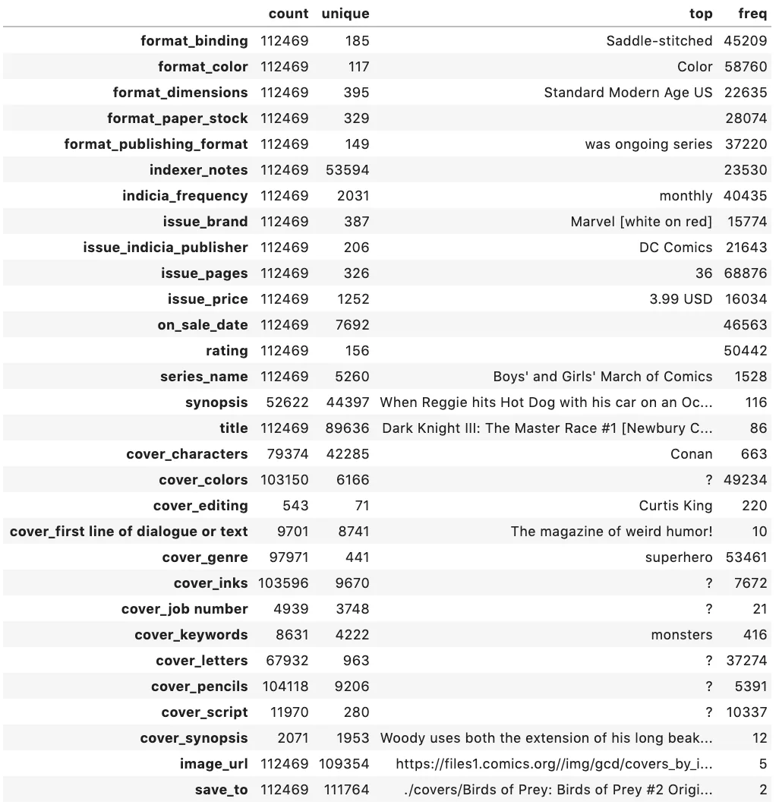

There are 79K issues with a non-empty `cover_characters` field, identifying which characters are drawn on the cover. There is also information related to artist (`cover_pencils`, `cover_inks`, and `cover_colors`), `cover_genre`, and `cover_synopsis`. Here’s an example of a record in the dataset with some metadata.

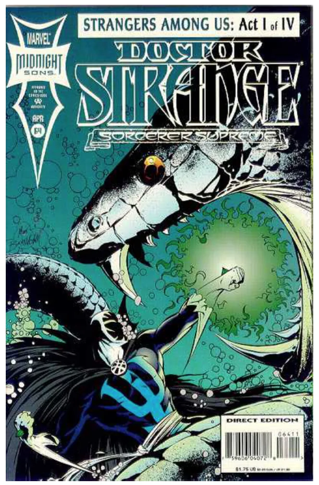

```
Pencils: Mark Buckingham
Colors: Mark Buckingham
Colors: ? 

Characters: ['Strange', 'The Brilliant One'] 

Synopsis: Strange searches for the next piece of Earth Magic, the Corel Crab, in the cave of The Brilliant One a Leviathan near Namor's Aquaria. On land, Salom‚ gives us a brief glimpse of her new servant, Wong!
```

---

If you want to download the dataset, you can grab it from this public [s3](https://comics-net.s3-us-west-1.amazonaws.com/all_data/covers.tgz) location, just cite [me](https://github.com/macrae/comics-net) in anything you publish.

## Designing an ML Task

Next, I need to design a task and train a learner. My intuition is that, of all the metadata, the `cover_characters` label will have one of the strongest signals to train a supervised learner against the cover image.

But why start with `cover_characters` and not `cover_pencils`, `genre`, or `synopsis`? One reason is that it seems more feasible to delineate between Superman and Batman in a drawing than it does to determine if Dan DeCarlo or Curt Swan drew it. This intuition comes from considering the potential features that a learner could key off— many artists, especially those of the same era, share qualities in their work. However, Superman is always qualitatively distinct from Batman, in very consistent and distinct ways.

Another reason that I prioritized `cover_characters` as a first attempt is that many other `cover_` fields, like `cover_pencils` or `cover_colors`, don’t have as robust a distribution of labels. For example, the most frequently occurring artist is Gil Kane, with 1,095 covers followed by Jack Kirby with 1,074. Yet, Batman is the most frequently occurring character featured on 5,263 covers, followed by Archie with 4,427.

<figure class="wp-block-image size-large is-resized">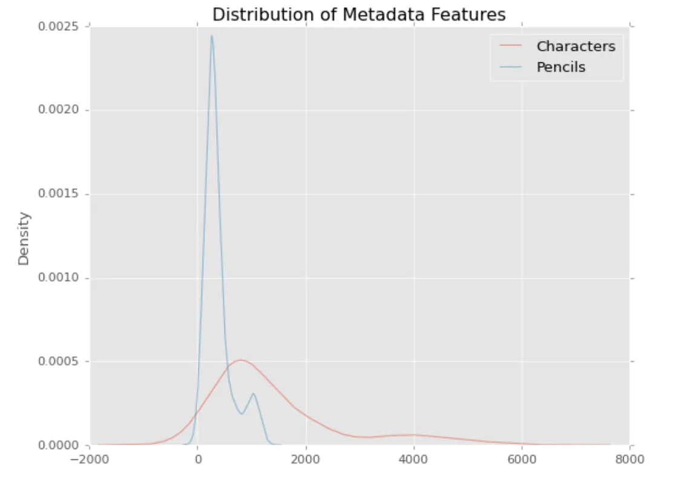<figcaption>The distribution of Character labels is more robust than other metadata labels.</figcaption></figure>

## The Multiverse

The question now becomes: what characters to include? The total number of unique characters in the dataset is 31K, and it’s _very_ long-tail. Attempting to train a learner to classify all characters is not feasible. So what characters do I target?

It may help to know that many characters coexist in the same universe in the world of comics. Archie Andrews, Jughead Jones, Betty Cooper, and Veronica Lodge all appear in the “Archie” series. Betty and Veronica also have their own series, aptly named “Betty and Veronica,” in which Archie, Jughead, and a slew of other tertiary characters inhabit. The multiverse theme goes double for Marvel and DC. Both publishers have grown their worlds into all-encompassing universes where Wonder Woman teams up with Detective Chimp, Man-Bat, Swamp Thing and Zatanna to wage war with the mystic arts. Marvel’s Civil War arc is one of the most well-known slugfests to take place in a multiverse, with some covers featuring dozens of characters densely packed into a single frame to let potential buyers know which book to pick up that week.

<div class="sm-gallery"><figure>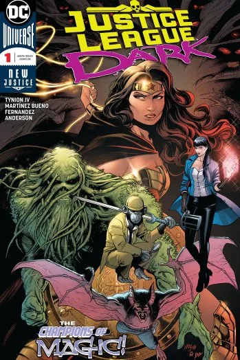</figure><figure>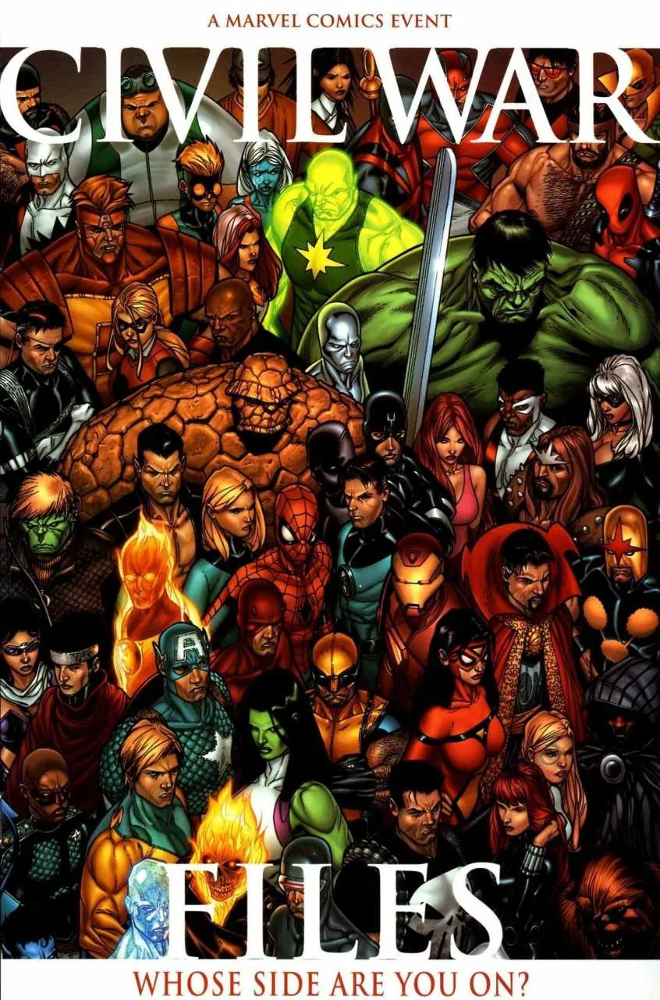</figure></div>

---

Characters co-occur within a universe either because of one-shots, team-ups, or cross-over events. But none of this information is explicit in the metadata that I scraped, so before I could start with the fun stuff, once again, it was back to the data grind. Fortunately for me, the good folks who update The Grand Comics Database often include team information in the `cover_characters` label. It required more regex than I typically enjoy (which is none), but I was able to parse out team names from the `cover_characters` field. Using team information would allow me to construct a training dataset containing characters that frequently co-occur, which would force the learner to discern nuance between the physical traits of characters.

After parsing team information from the characters label, this is the number of cover images and character labels for each team.

| Group | # Images | # Labels |
|---|---|---|
| Justice League | 12,445 | 16 |
| Avengers | 7,186 | 16 |
| Spider-Man | 6,231 | 25 |
| X-Men | 5,589 | 30 |
| Archies | 5,550 | 23 |
| Teen Titans | 3,557 | 14 |
| Fantastic Four | 2,897 | 6 |
| Defenders | 2,023 | 10 |
| Legion of Super-Heroes | 1,298 | 23 |
| Justice Society of America | 1,291 | 12 |
| Suicide Squad | 971 | 8 |
| Inhumans | 548 | 6 |
| Guardians of the Galaxy | 378 | 5 |
| New Gods | 338 | 7 |
| Lantern Corps | 805 | 20 |
| Doom Patrol | 188 | 10 |

I included many characters that may not be part of a team, but happen to co-occur frequently alongside certain team members, for example, Lois Lane, Namor, The Joker, Black Canary, etc. Also, Spider-Man isn’t a “team,” I just threw all of the Spider-People (Spider-Man \[Peter Parker\], Spider-Man \[Miles Morales\], Spider-Woman, Spider-Gwen, etc.) into one group, because, why not?

Since the [Justice League](https://en.wikipedia.org/wiki/Justice_League) characters are associated with the most cover images, I figured I’d start there.

## Multi-label Character Classification

### The Dataset

The Justice League dataset contains 12,445 images, each of 400 x 600 resolution. There are 16 character labels, and an image can have more than one label. This is known as a multi-label task because we need to classify $n$ of $m$ possible labels, where $1 <= n <= m$. For example, a cover image may contain only Superman, only Batman, or possibly both.

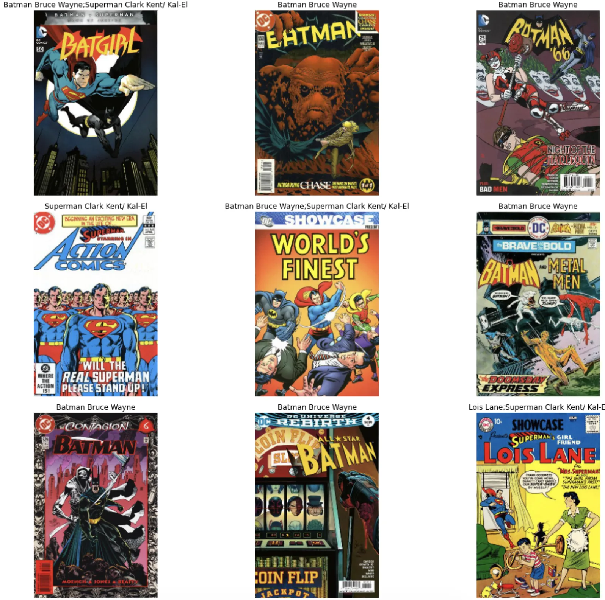

---

```
Train: LabelList (9956 items)
x: ImageList
Image (3, 300, 200),Image (3, 300, 200),Image (3, 300, 200),Image (3, 300, 200),Image (3, 300, 200)
y: MultiCategoryList
Green Arrow Oliver Queen,Wonder Woman Diana Prince,Batman Bruce Wayne,Batman Bruce Wayne,Flash Barry Allen
Path: /content/justice_league;

Valid: LabelList (2488 items)
x: ImageList
Image (3, 300, 200),Image (3, 300, 200),Image (3, 300, 200),Image (3, 300, 200),Image (3, 300, 200)
y: MultiCategoryList
Flash Barry Allen;Cyborg Victor Stone,Wonder Woman Diana Prince,Batman Bruce Wayne,Batman Bruce Wayne,Batman Bruce Wayne
Path: /content/justice_league;
```

---

There are a lot of Batman and Superman images in the above dataset preview. Based on the distribution of character labels, this is not surprising. I will need to be sensitive to this class imbalance when evaluating the model’s performance.

| Character | # Images |
|---|---|
| Batman \[Bruce Wayne\] | 4,939 |
| Superman \[Clark Kent/ Kal-El\] | 4,062 |
| Wonder Woman \[Diana Prince\] | 1,806 |
| Flash \[Barry Allen\] | 1,472 |
| Green Lantern \[Hal Jordan\] | 1,024 |
| Green Arrow \[Oliver Queen\] | 727 |
| Aquaman \[Arthur Curry\] | 677 |
| Hawkman \[Katar Hol/ Carter Hall\] | 649 |
| Catwoman \[Selina Kyle\] | 579 |
| Lois Lane | 533 |
| Martian Manhunter \[J’onn J’onzz\] | 489 |
| Joker | 452 |
| Black Canary \[Dinah Laurel Lance\] | 442 |
| Cyborg \[Victor Stone\] | 417 |
| Jimmy Olsen | 284 |
| Hawkgirl \[Shayera Thal\] | 209 |

In hindsight, this dataset is flawed for the first attempt at this task. The classes are way too imbalanced. If I could go back and reconfigure the dataset (which I will in a future research spike), I’d limit the character labels to the top 3, maybe 5.

### Model Definition

A lot of success in deep learning on image-based tasks is attributed to creating deeper neural networks. The first CNN that outperformed standard machine-learning with hand-tuned features was in 2012. It consisted of 8 layers and was called AlexNet. Today, CNN’s consist of 3 – 12 times the number of layers of AlexNet, the intuition being that subsequent layers learn more complex features. Layers in the front of the network end up learning the building blocks of later layers. The first layers learn to see vertical and horizontal edges. The following layers learn to see geometric shapes like squares and diamonds. Eventually, layers can see features like people’s eyes and cat ears.

But the deeper a CNN gets, a problem emerges related to how networks learn and weights get updated. Basically, all those chain-rule updates cause the gradient to vanish due to the distance between the loss function and the input layer.

<figure class="wp-block-image size-large">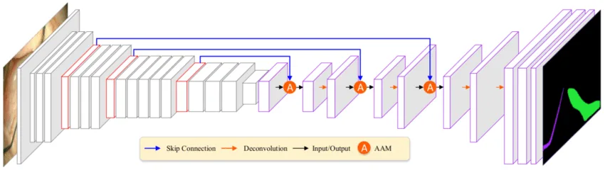<figcaption>Resnet34 Arcitecture</figcaption></figure>

The novel design element of a ResNet is the skip connection to deal with very deep networks where the gradient may disappear. The residual block was introduced to address the vanishing gradient problem. It’s a simple and powerful concept. As a convolutional network goes deeper, the gradients quickly shrink to zero, and hence no learning occurs. The skip connection in a ResNet allows the gradient to flow backward more readily, acting as a kind of a gate, allowing information to flow through the entire network.

### Model Training

Due to memory constraints, the images were resized to 200 x 300 with a batch size of 32. To keep the original resolution, I could reduce the batch size to something like 16 or 8 – but for now, this is fine. I used the fastai learning rate finder and trained for eight epochs at what seemed like a reasonable learning rate.

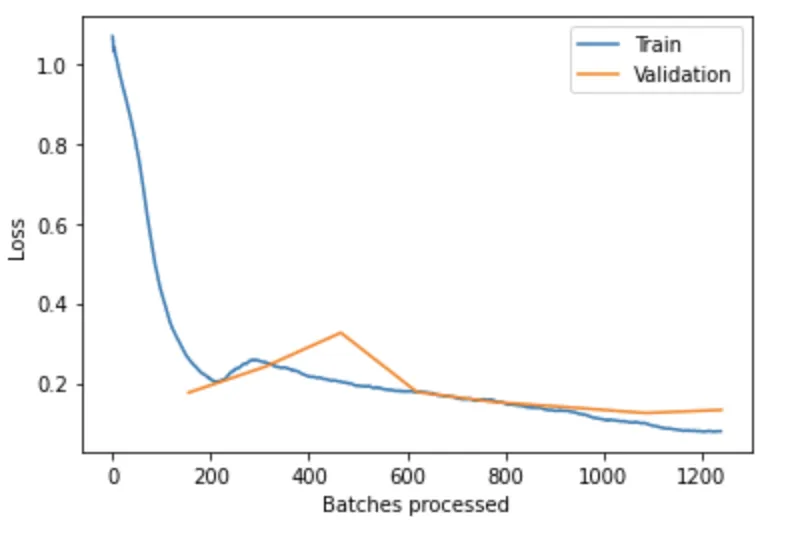

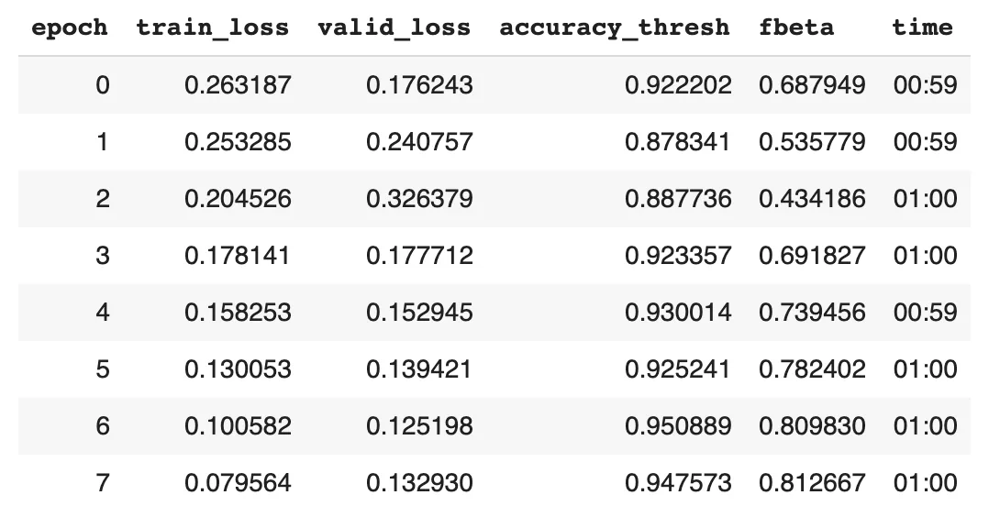

After 8 epochs, the validation loss and accuracy is starting to flatten out. Against the 2,488 cover images in the validation set, I have a 95% accuracy and fbeta score of 0.81. The fbeta is like an f1 score, representing a weighted average of precision and recall.

I reran it for 3 more epochs with a lower learning rate to see if I could fine-tune it anymore.

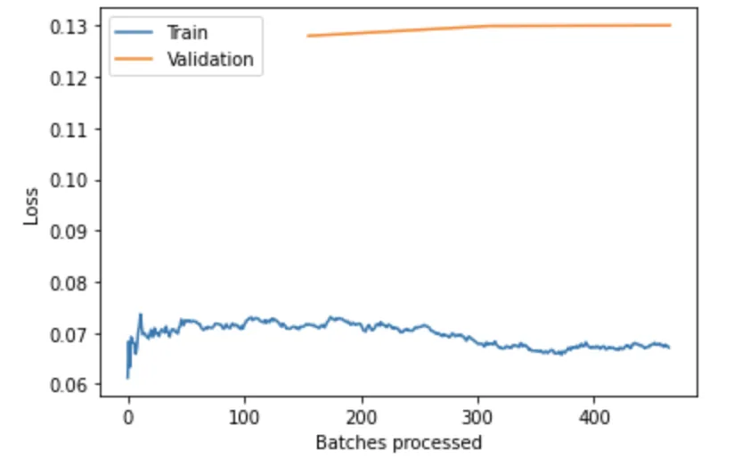

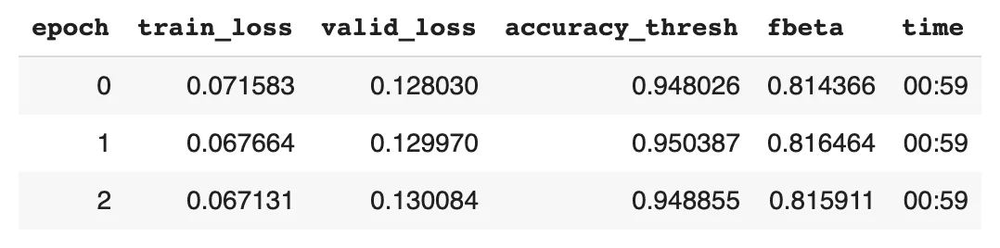

Because the validation loss and accuracy get worse as the training loss improves, this is a sign to me of overfitting to the training set, so I’ll call it a day.

### Model Evaluation

While looking at the reported model metrics during training, I may be led to feel good about how well the model performed, but I remember the classes are severely imbalanced. Therefore, I need to assess performance at the level of each character label.

<div class="sm-gallery"><figure>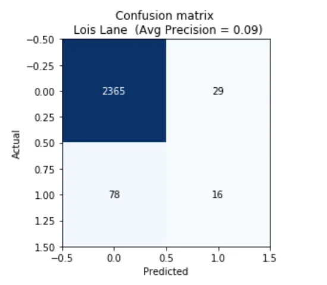</figure><figure></figure><figure>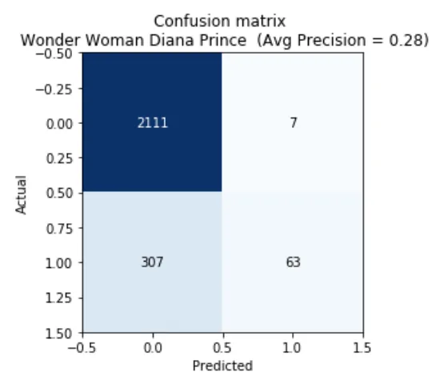</figure><figure>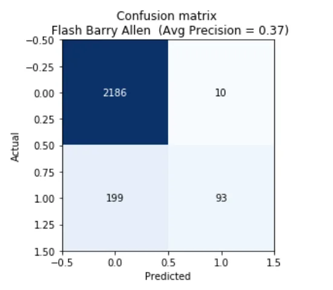</figure><figure>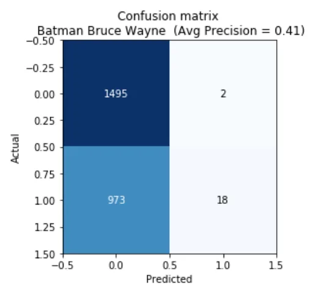</figure><figure>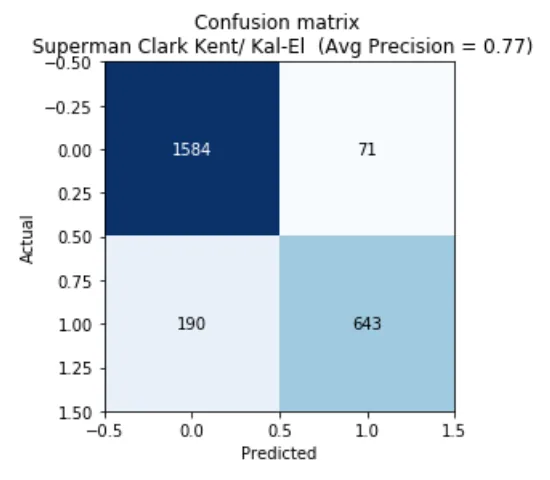</figure></div>

Overall, _the precision is garbage_. What’s boosting the accuracy and fbeta score is the true-negative rate, which is captured in the upper left quadrant of the confusion matrix. The model is much better at determining if a character is _not_ in an image than if they _are,_but because so many characters appear so infrequently, even a naive model that always guessed that a character _does not appear_ would have a favorable-looking accuracy and fbeta score.

## What is the Model Looking at?

Using the Gradient-weighted Class Activation Mapping (Grad-CAM) implementation in fastai, I visualized what the trained model is “seeing.”

<figure class="sm-gallery-fig"><div class="sm-gallery"><figure>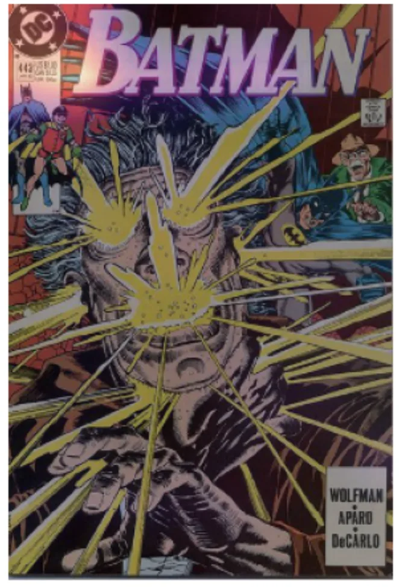</figure><figure>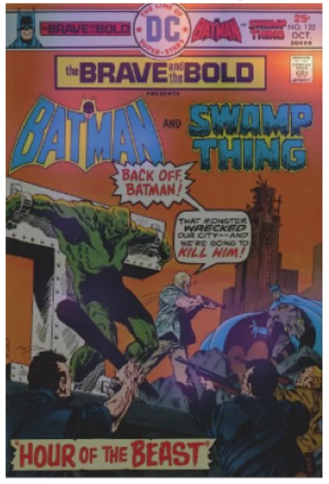</figure><figure>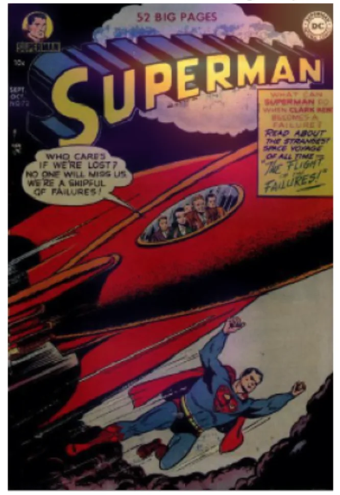</figure></div><figcaption>The highlighted areas of the above images show what the Neural Net is looking at when classifying characters on comic book covers.</figcaption></figure>

---

It appears the model is keying off non-drawn features like barcode, publisher logo, and series title, which is a bummer because I intended to train a network to see the many hand-drawn artistic elements that make up comic book covers. But, it’s honed in on, in my opinion, the least interesting visual elements. These results are unfortunate, but it’s at least a lesson to take into the next experiment.

## Conclusion

This research spike discovered that performing multi-label character classification on comic book covers using a ResNet34 architecture did not work well due to non-drawn entities that carry a lot of information about what characters appear on what cover. Also, the class imbalance and low hit rate of some labels in the Justice League training set make accuracy and fbeta look much more favorable at an aggregate level during training.

## Next Steps

1. Investigate approaches to control for non-drawn entities on comic book covers.
2. Reconfigure the training dataset to be more balanced.
