## Motivation

Achievements in machine learning over the last decade, especially for vision and natural language, are pretty amazing when you stop to think about it.

I hadn’t given it much thought until I watched the first video in Jeremy Howard’s tremendous [Practical Deep Learning for Coders, v3](https://course.fast.ai/) lecture series.

The first video covers an image classification task using the [Oxford-IIIT Pets Dataset](http://www.robots.ox.ac.uk/~vgg/data/pets/). Given 1,000 images of thirty-nine different dog and cat breeds, the task is to classify each image as one of the thirty-nine possible breeds.

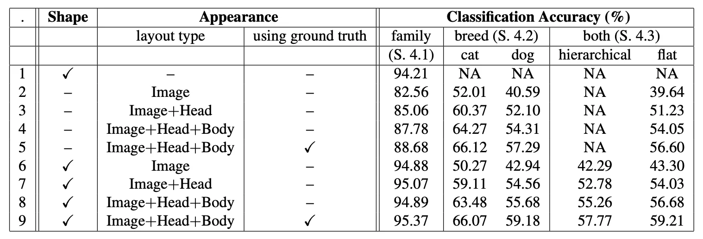

This table shows the accuracy that researchers in statistical learning could achieve for this machine learning task in 2012. Various approaches are between 50% and 60% accurate when identifying the correct pet breed, which is not at all bad considering a naive model would only be about 2.5% accurate.

## **ML For Fun**

So what does all of this have to do with comic books? The way I see it, modern machine learning is as much about automating the menial and improving public safety as it is about delighting and augmenting human creativity. There are many AI projects whose intent is to delight rather than perform some civic or business utility.

- [InfinitePatterns](https://experiments.withgoogle.com/infinitepatterns)
- [Spiral by DeepMind](https://github.com/deepmind/spiral)
- [Botnik](https://botnik.org/)

## Modern Machine Creativity

Check out what Botnik did with this [Harry Potter](https://botnik.org/content/harry-potter.html) piece.

> _The castle grounds snarled with a wave of magically magnified wind. The sky outside was a great black ceiling, which was full of blood. The only sounds drifting from Hagrid’s hut were the disdainful shrieks of his own furniture. Magic: it was something that Harry Potter thought was very good._
>
> ~Botnik

That’s not even close to bad by human standards. Taking a small quote for inspection is different than reading across paragraphs, and that’s where today’s natural language processing models fall short – because after a short number of consecutive sentences it becomes clear the writer of this content is producing pretty much just gibberish –  but even that has been improved with BERT-2.

Reading machine prose like this, to me, can feel like accessing some of an alternate computer-verse. At first glimpse, it feels the same as my own reality’s version. Still, upon inspection, you realize everything is just a bit off, some artifact that passed through the membrane of universes.

It’s like Bizarro’s world of Earth-29 compared to Earth-0. For those of you not familiar with the DC Multiverse, the Earth-29 trope is subversion. So, if Superman on  Earth-0 saves puppies from trees,  then Bizarro puts puppies in trees; he also burns down houses, lives on the planet Htrae, and is a member of the Unjustice League… _because of course, he is_.

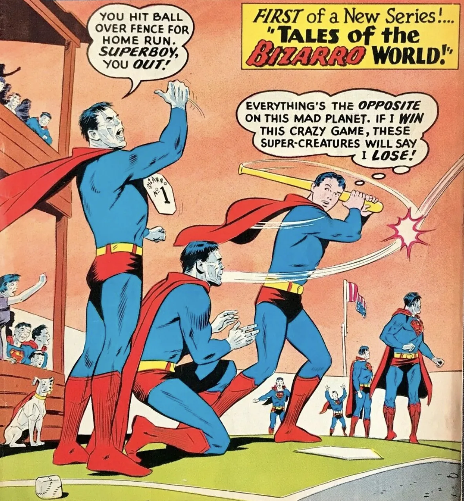

> _“Us do opposite of all Earthly things! Us hate beauty! Us love ugliness! Is big crime to make anything perfect on Bizarro World!”_
>
> ~_Bizarro_

What’s always interested me about Bizarro is that he’s more of a commentary on Superman (of Earth-0) than anything else. Bizarro provides a contrast to the Man of Steel in an ultimately, diametric way so that Bizarro can only be the way he is because Superman is the way he is. I guess it’s all relative though, and people on Earth-29 would think Superman of Earth-0 is a commentary on Bizarro – which is fine.

<figure class="wp-block-image size-large is-resized">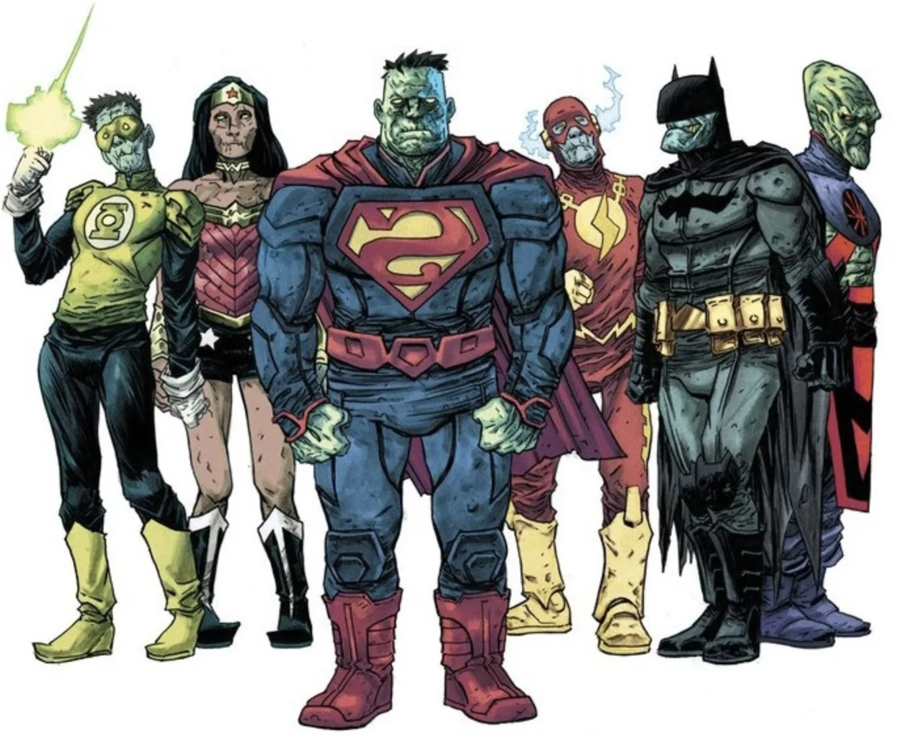<figcaption><strong>Earth-29 Un-superheroes</strong></figcaption></figure>

The point is – examining these artifacts ripped from the multiverse are interesting not just in what they say for themselves, but for what they say about ourselves. And so it is similar to computer creativity, in what it says about us as humans more than what it says about the machines that created it.

Not every alternate universe is as stark a comparison as Earth-29, though. Some are more nuanced and draw subtler parallels, like Eath-10, the Nazi-themed world where everybody’s favorite caped crusaders formed under the third-Reich. What can a world where the Justice League fights alongside Adolf Hitler tell us about our own beliefs and morals?

<figure class="wp-block-image size-large is-resized">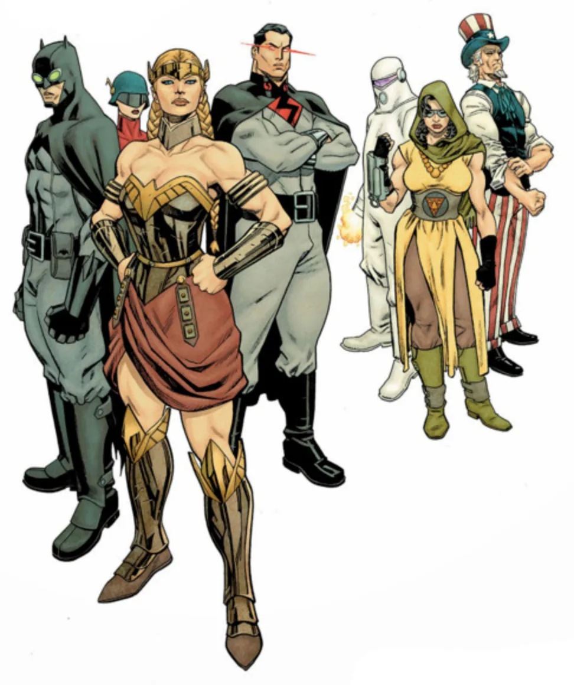<figcaption><strong>Earth-10 Superheros</strong></figcaption></figure>

On Earth-23, where every superhero is black, Superman is also the President of the United States. Wonder Woman, who is called Nubia, brought anti-war technology to the world. What can a world where the bonds of slavery don’t exist, tell us about our own social construct? What can Earth-11, the matriarchal world of Superwoman, Batwoman, and Wonder Man tell us about our own sex and gender biases?

<figure class="wp-block-image size-large is-resized">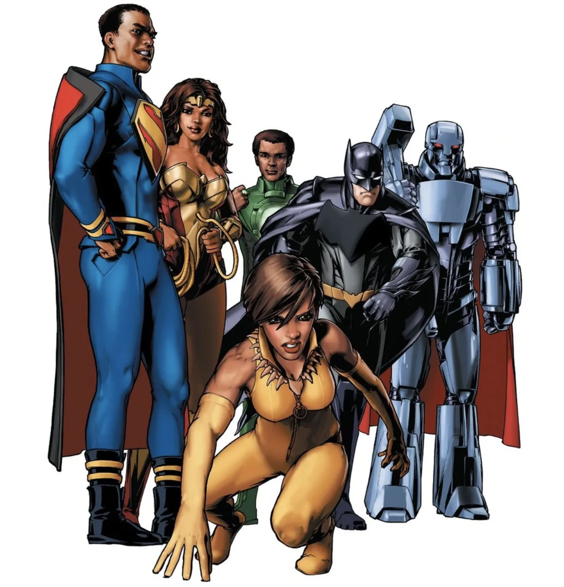<figcaption><strong>Earth-23 Superheroes</strong></figcaption></figure>

As machines get better at appearing human, these computer-verse artifacts start to feel less like something from the Bizarro-verse and more like something from a universe indistinguishable to our own. We are moving from a world where computer-generated media is interesting because of what it can tell us about us, to a world where it is interchangeable with our own. How simultaneously wondrous and horrifying. Any technology subject to the whims of its practitioner can be bent to their will. What ethical AI entails is an ongoing and important conversation, so the topic of ethics in AI will be addressed when appropriate. It’s important to reflect on the implications of this technology and how it has been or could be, weaponized.

## **So, what am I trying to do again, or: Where do I even start?**

_When breaking down any machine learning task, I like to ask myself: as a human, how would I do this thing, step-by-step?_

As a human, how do I read a comic book? I’ve never really given it much thought, it’s not one of those existential questions that keep me up at night – but to answer, I know I definitely start with the cover.

In fact, I start reading most comic books long before I ever buy them, while perusing the weekly drop of issues at [Isotope Comics](http://www.isotopecomics.com/).

…. what do I do when I read a cover? What do I know about covers?

Publishers will put out a smattering of variant covers to boost sales.  This is especially effective on people with OCD with a tendency towards hoarding.  Check out these variant covers for Batman 66′ #1.

<figure>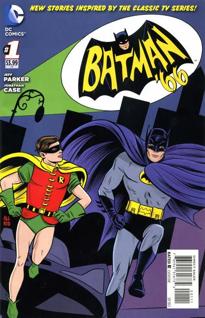</figure><figure>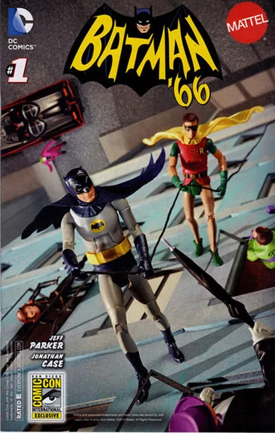</figure><figure>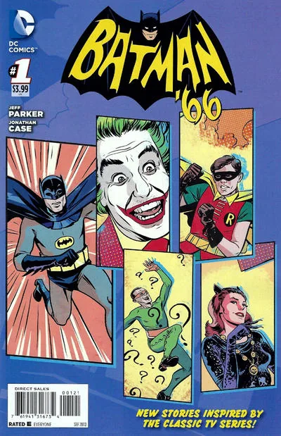</figure>

Sometimes publishers will bring in heavy hitters to draw even more covers when launching series. When Marvel launched their All-New Wolverine series starring Laura Kinney as everybody’s favorite adamantium-clawed-regenerating-mangler, they published eleven different cover variants – featuring artist favorites like, \[…\].

<figure></figure><figure>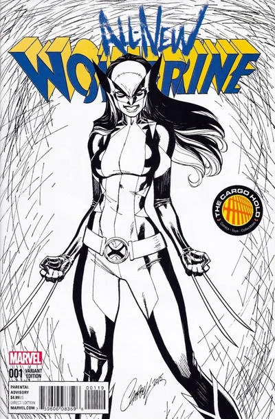</figure><figure>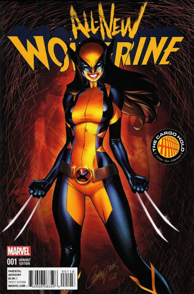</figure><figure>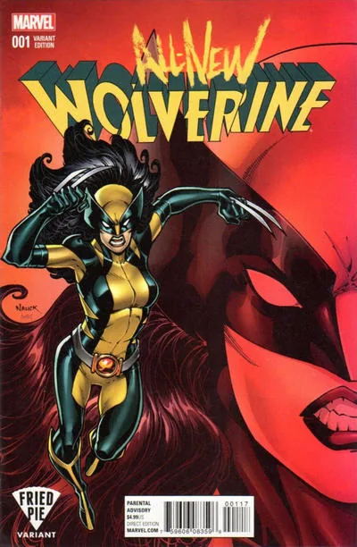</figure><figure>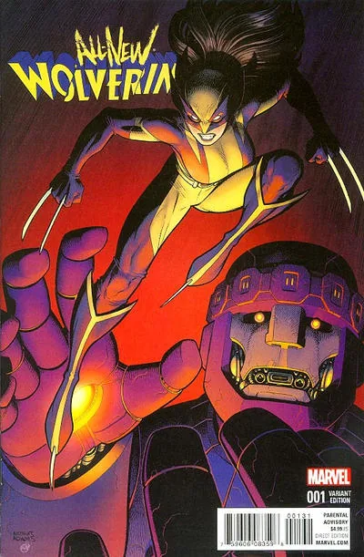</figure><figure>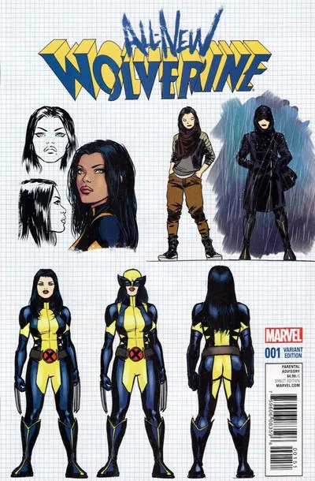</figure><figure>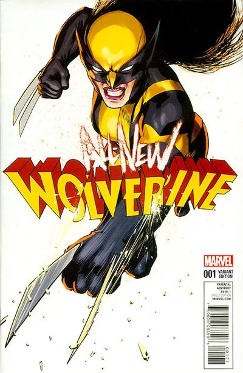</figure><figure>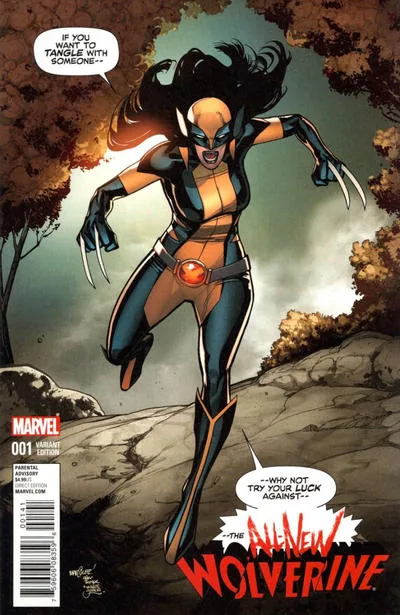</figure><figure>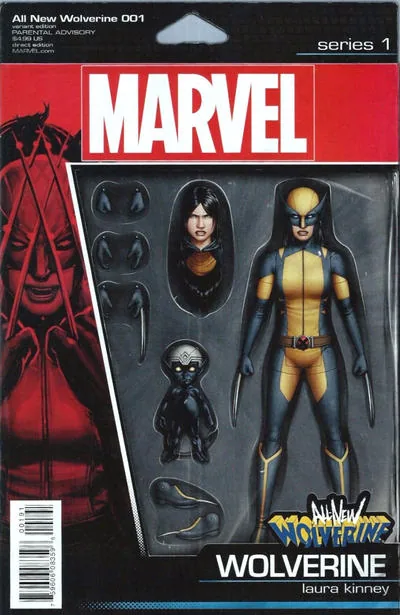</figure><figure>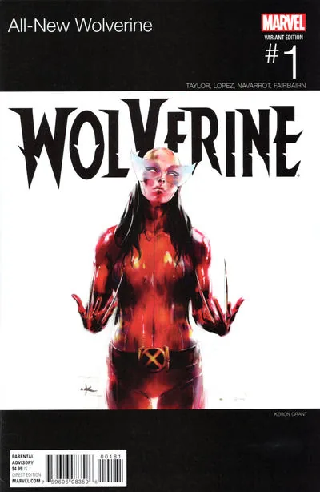</figure><figure>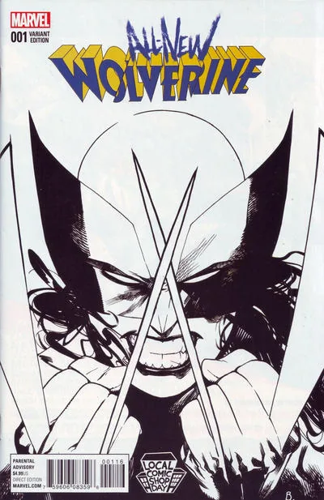</figure>

They may also have requirements for cover art based on their own belief of what sells. Have you ever seen an issue of Batman without the Dark Knight crouched on the eve of a roof or swinging effortlessly through the air?

<figure>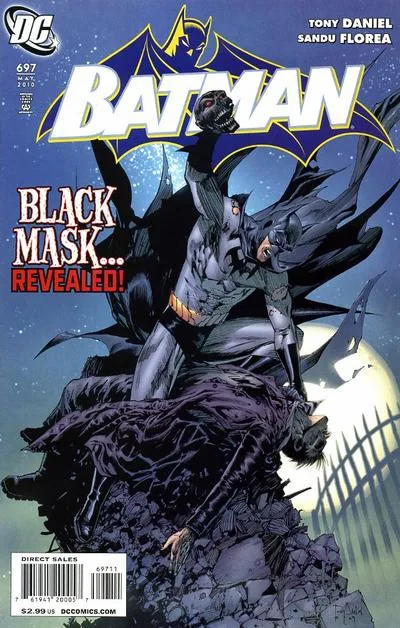</figure><figure>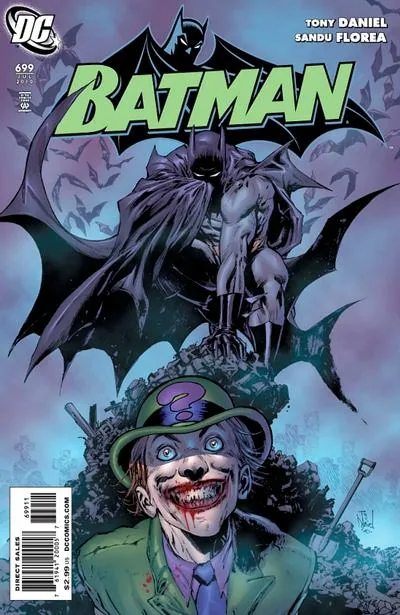</figure><figure>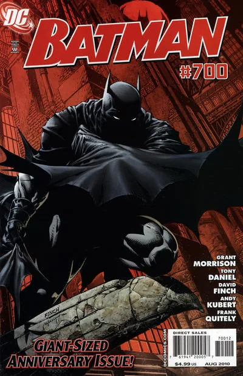</figure>

Specifically, as a human, given a comic book cover, I can identify most of the characters on it. I can give a description of the scene shown, like who is fighting who, or does it take place in space? I can determine the series name from its title and may be able to infer part of the story through subtitles and text. I have a relative sense of the era it was published, based on the art, and I may be able to determine the artist.
