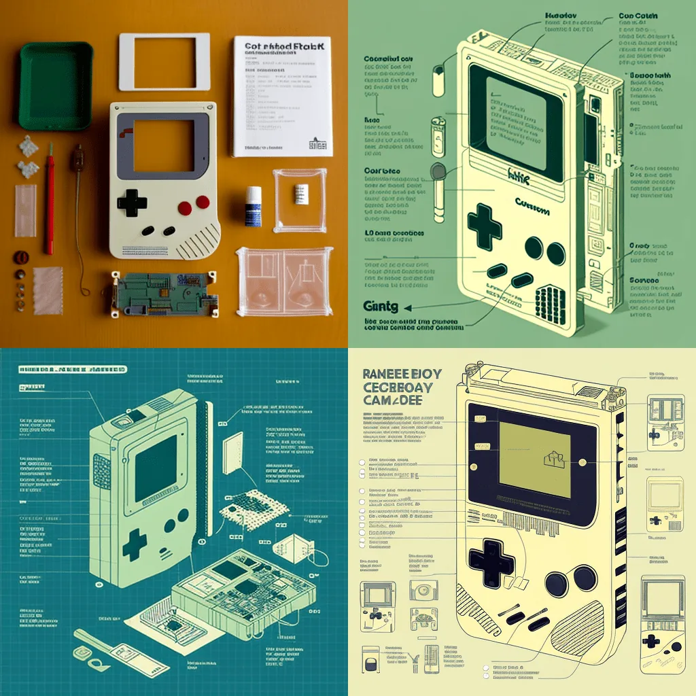
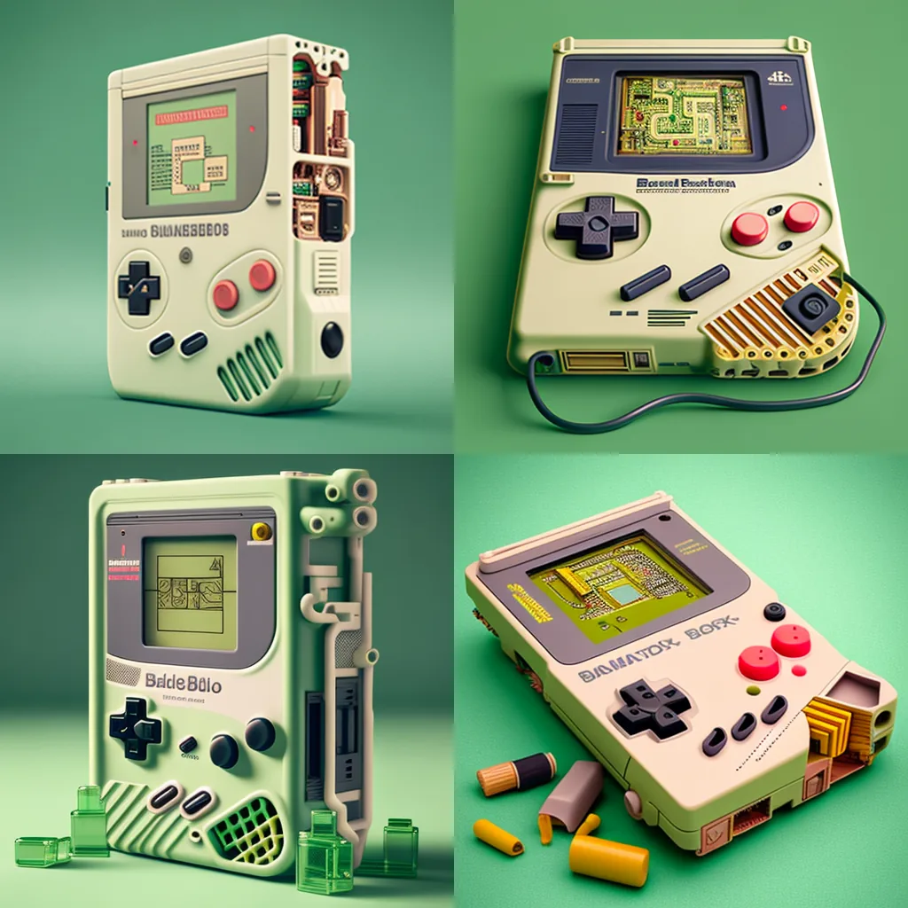
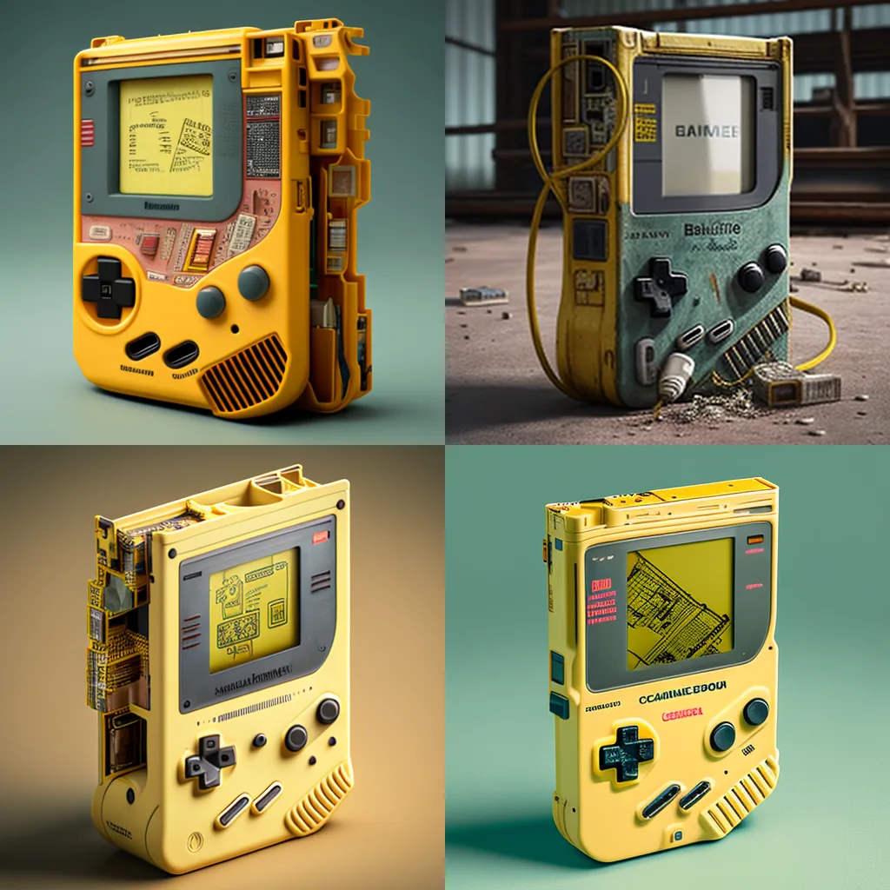

As a parent, finding a few moments of solitude can be challenging. But in these precious moments — when I could be doing something actually productive – I often find myself exploring the vast and mysterious realm of the Midjourney text-to-image Discord server (a Stable Diffusion algorithm). I recently explored the Gameboy’s latent space for nostalgia and comfort in this fast-paced, digital world I live within – a much welcome respite.

I enjoy taking something familiar and well-known and casting it in a new light, and these Stable Diffusion models can transport me to new and unfamiliar contexts and perspectives with a single prompt. That’s why in this series, I have also included descriptions – written by myself – as an art critic examining each one on its visual merits and my emotional response to the piece.

## Gameboy by IKEA

This piece makes me feel excitement and anxiety, like staring down the barrel of a daunting – yet ultimately rewarding task. You know the kind, right? The “this-was-only-supposed-to-take-an-hour” three-hours later vibe? The level of detail is fantastic, with delicate lines and dense blocks of text and arrows creating a sense of narrative. This feels like a luxury brand because it has crafted a story within a single image, elevating beyond the assembly diagram into art.

## Punk Rock Gameboy

Evoking the iconic style of black and white checkered Vans of my childhood, these devices exude a vintage charm reminiscent of the sturdy electronics of the late 80s. They are powered by batteries, likely requiring a healthy supply of double A’s. Despite their rough-around-the-edges appearance, with paint-worn, grime, and sweat-caked buttons that need a bit of extra force to register, they have been well-loved and used to their full potential. The fabric straps enhance their appeal and add a touch of individuality.

## Gameboy by Black & Decker

These industrial Gameboys have a rugged, practical look that makes them feel more like tools than toys. The buttons provide a satisfying feeling every time you press them; they will wear nicely over time. The screens display diagrams like microchips from the classic game, The Legend of Zelda. You feel like you’re interacting with the machine’s inner workings when you play these, which makes the experience all the more immersive and rewarding.

## Clear Gameboy

Videogame hardware design reached its pinnacle with the transparent Nintendo 64 console, a beloved relic of my childhood. The ethereal translucency of that era has been revitalized in these resin handhelds, emanating a vibrant, electric energy that pulsates with life. Indeed, the hardware is a captivating spectacle, far surpassing the appeal of the content displayed on the screen of the video game.

## Battle-scarred Gameboy

Unfortunately, these devices are no longer functional. They may flicker to a glitched screen before eventually freezing or dying, their pixels drained of life. Upon opening the back panel to change the batteries, you find a damp interior, the plastic surface slick with tiny water beads. These were once cherished and well-used companions, but now they have been left to rot in a state of abandonment and neglect, a mere shadow of their former glory.

## Gameboy by REI

These devices are not solely relegated to the realm of video games. Instead, they are multifunctional, serving as all-in-one GPS, radio, and walkie-talkie survival handsets. They are the ultimate tech tool for hikers, designed to be rugged and withstand even the most adverse weather conditions. The premium model even boasts a star tracker app, allowing users to navigate by the celestial light of the stars. However, it must be noted that the menu interface is notoriously cumbersome and difficult to navigate.

## Gameboy by Dewalt

The bold, vibrant hue of Dewalt Yellow adds a layer of dynamism. The upper-left image is particularly striking, perfectly capturing the essence of meticulous attention to detail and craftsmanship. The various sensors and electrodes on these devices speak to their intricacy and sophistication, making it clear that these are not inexpensive trinkets but serious pieces of hardware.

## The Gameboy Grail

When one has the means and desire to indulge in a lavish display of excess, the 24k gold Gameboy is the ultimate choice. While it may not provide the most ergonomic or enjoyable gaming experience, its actual value lies in its ability to function as a conversation piece and symbol of affluence. Display it prominently in one’s home as a conversation starter, or tuck it away in a safe alongside other precious items such as Morgan dollars, stock, and bond certificates for safekeeping.

## The Crystal Gameboy

Crafted from a single, breathtaking block of Aquamarine, these Gameboys exude a sense of opulence and luxury. The faceting skillfully interacts with light, creating a mesmerizing visual effect. The gem studs set within the directional pad serve as a delightful finishing touch, adding a layer of refinement and elegance – a stunning visual presence when displayed on a shelf with dramatic backlighting.

![The crystalline Game Boy is a truly stunning piece of craftsmanship. The device is made entirely of shimmering gems and crystals, each one carefully chosen and placed to create a visually stunning and structurally sound handheld gaming system. The central processing unit, depicted as a glowing crystal orb at the heart of the device, is made of a shimmering sapphire, known for its clarity and strength. The memory management unit and graphics processing unit, depicted as sparkling crystal clusters on either side of the orb, are made of sparkling diamonds, known for their unparalleled beauty and durability. The sound processing unit, depicted as a crystal horn on the top of the device, is made of a glowing amber, known for its warm, soothing properties. The power supply unit, depicted as a crystal battery pack on the back of the device, is made of a glowing emerald, known for its ability to provide long-lasting energy. The charging circuit, depicted as a crystal charging port on the side of the device, is made of a shimmering amethyst, known for its ability to transmit energy efficiently. The cartridge slot, depicted as a crystal slot on the bottom of the device, is made of a glittering ruby, known for its ability to hold and process data. Each element of the device is expertly crafted and meticulously placed, and the overall effect is truly breathtaking. The crystalline Game Boy is a work of art that any true connoisseur of fine craftsmanship will appreciate and admire.](media/4163381430ead3e627dd902b73a1a1b9f8c54e14.webp)

![The crystalline Game Boy is a truly stunning piece of craftsmanship. The device is made entirely of shimmering gems and crystals, each one carefully chosen and placed to create a visually stunning and structurally sound handheld gaming system. The central processing unit, depicted as a glowing crystal orb at the heart of the device, is made of a shimmering sapphire, known for its clarity and strength. The memory management unit and graphics processing unit, depicted as sparkling crystal clusters on either side of the orb, are made of sparkling diamonds, known for their unparalleled beauty and durability. The sound processing unit, depicted as a crystal horn on the top of the device, is made of a glowing amber, known for its warm, soothing properties. The power supply unit, depicted as a crystal battery pack on the back of the device, is made of a glowing emerald, known for its ability to provide long-lasting energy. The charging circuit, depicted as a crystal charging port on the side of the device, is made of a shimmering amethyst, known for its ability to transmit energy efficiently. The cartridge slot, depicted as a crystal slot on the bottom of the device, is made of a glittering ruby, known for its ability to hold and process data. Each element of the device is expertly crafted and meticulously placed, and the overall effect is truly breathtaking. The crystalline Game Boy is a work of art that any true connoisseur of fine craftsmanship will appreciate and admire.](media/543690c88185531eaa01a82622ab3924894d4ee2.webp)

## The Multicellular Gameboy

The organic, spindling tubes coiling in on themselves remind me of an otherworldly multicellular organism. Like a virus grafted onto the microprocessor of a Gameboy, slowly taking over the inorganic material of the device and repurposing it for its survival. The result is a disturbing fusion of an orange tree and machine, a cosmic space robot with a sinister agenda.

![The organic, multicellular Game Boy is a truly stunning piece of art. The artist has captured the complex network of systems that power the device in breathtaking detail, with each system rendered in vivid, lifelike colors. The central processing unit, depicted as the brain of the organism, is a mesmerizing swirl of oranges and yellows, with intricate details that highlight the intricate structure of this vital body part. The memory management unit and graphics processing unit, depicted as sensory appendages, are a vibrant shade of green, with delicate details that show the intricate structure of these appendages. The sound processing unit, depicted as the vocal cords, is a stunning shade of blue, with subtle shades and gradations that bring this appendage to life. The power supply unit, depicted as the circulatory system, is a deep, rich red, with delicate details that highlight the importance of this body part in maintaining the health of the organism. The charging circuit, depicted as the immune system, is a shimmering gold, with subtle details that show the complex structure of this vital body part. The cartridge slot, depicted as the digestive system, is a rich, earthy brown, with intricate details that highlight the important role this body part plays in processing game data. Each element of the painting is expertly detailed and meticulously crafted, and the overall effect is truly breathtaking. It's a work of art that any true connoisseur of fine art will appreciate and admire.](media/28ae5a3701ed9168d6be168e766f2ae7a923beed.webp)

![The organic, multicellular Game Boy is a truly stunning piece of art. The artist has captured the complex network of systems that power the device in breathtaking detail, with each system rendered in vivid, lifelike colors. The central processing unit, depicted as the brain of the organism, is a mesmerizing swirl of oranges and yellows, while the memory management unit and graphics processing unit, depicted as sensory appendages, are a vibrant shade of green. The sound processing unit, depicted as the vocal cords, is a stunning shade of blue, and the power supply unit, depicted as the circulatory system, is a deep, rich red. The charging circuit, depicted as the immune system, is a shimmering gold, and the cartridge slot, depicted as the digestive system, is a rich, earthy brown. Each element of the painting is expertly detailed and meticulously crafted, and the overall effect is truly breathtaking. It's a work of art that any true connoisseur of fine art will appreciate and admire.](media/8bc8f05f096d8fb6ce00ca3f3f94817d11d0fea6.webp)
