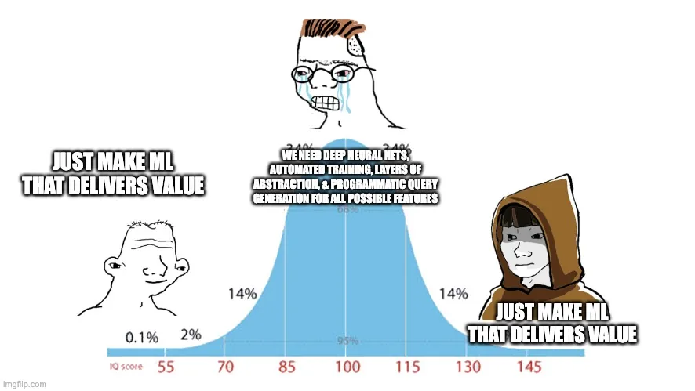

It is intriguing to observe that even the most technically proficient data scientists often fall short in their scientific approach. These individuals are undoubtedly skilled in their domains—coding, analytics, quantitative analysis, or statistical inference. They bring a wealth of knowledge and expertise to the table, and there is much to learn from them. However, the issue arises when scientific rigor, crucial in data science, is not given its due importance. This lack of scientific rigor is not necessarily a reflection of the individual’s capabilities but rather an outcome of the systems and structures within which they operate.

**Understanding the Scientific Nature of Data Science**

Data science, at its core, is a scientific discipline. It involves formulating hypotheses, conducting experiments, and analyzing results. However, the natural inclination towards scientific inquiry and the systematic approach it requires is not inherent. It demands deliberate practice and experience to internalize. Moreover, the organizational environment plays a significant role in nurturing or stifling this scientific temperament. Organizations that are averse to risks inadvertently create an environment that is hostile to scientific research’s explorative and often uncertain nature. In contrast, innovation-centric organizations structure themselves to encourage and reward scientific inquiry, understanding genuine innovation’s high-risk, high-reward nature.

Frameworks such as the Lean Startup methodology emphasize the importance of this scientific approach to innovation. The Build-Measure-Learn loop, a core component of this methodology, encourages entrepreneurs and innovators to treat their ventures as experiments, learning from each iteration and pivoting or persevering based on empirical evidence. This mindset is equally applicable and valuable in the realm of data science.

**Incentivizing Science for Innovation**

The dichotomy between incentivizing outputs versus outcomes is stark. When organizations focus solely on outputs, they encourage a checklist mentality. Data scientists in such environments become focused on delivering quantifiable artifacts – models, dashboards, reports – without a deep investment in these outputs’ actual impact. This approach fosters a culture where success is measured by the completion of tasks rather than the real-world impact of those tasks on the business.

On the other hand, when organizations prioritize outcomes, they focus on creating tangible value. This is where the true essence of data science shines – not just in building models but in solving real problems. The Scrum framework in Agile development echoes this sentiment by prioritizing value delivery in short, iterative cycles, focusing on continuous improvement and adaptation based on user feedback and changing requirements.

**From Outputs to Outcomes: Building What People Want**

The ultimate goal of data science should be to build solutions that address real needs. The famous adage, “Make something people want,” encapsulates this philosophy. It’s not just about creating sophisticated models or complex algorithms. It’s about understanding and solving the problems that matter to people. This does not necessitate grand solutions to all issues but instead advocates for incremental, tangible improvements that make a difference.

The Minimum Viable Product (MVP) concept from the Lean Startup methodology resonates with this approach. It’s about creating a basic version of the product that addresses the core problem, gathering feedback, and iterating. This iterative, outcome-focused approach ensures that data science efforts are aligned with actual user needs and organizational goals rather than being an exercise in technical prowess.

**Accountability and Advocacy in Data Science**

The notion that the responsibility of a data scientist ends with the delivery of a model is profoundly flawed. Data scientists must not only build models but also take ownership of the outcomes these models drive. They are in the best position to understand the model’s capabilities and limitations and, thus, should play a pivotal role in ensuring that the model is leveraged effectively.

Moreover, data scientists should act as advocates for their models. It’s not enough to build a model; they must communicate its value effectively, ensuring stakeholders understand its benefits and are equipped to utilize it. This involves shifting from a purely technical role to one encompassing communication, education, and advocacy.

**Embracing the Scientific Method in Data Science**

Finally, the scientific method must be at the heart of data science. Completing a set of predefined outputs is not the end. Instead, it’s crucial to rigorously test and validate the models, ensuring that they perform as expected in the real world. This involves continuous experimentation, validation, and refinement.

Metrics like ROC AUC are tools, not endpoints. They guide the development process but should not determine when a model is ready for deployment. The actual test of a model’s value is in its real-world performance and impact on decision-making and problem-solving.

In conclusion, transforming good data scientists into excellent ones involves:

- Fostering a scientific mindset.
- Aligning efforts with organizational goals.
- Focusing on outcomes rather than outputs.
- Taking ownership of the end-to-end lifecycle of models.
- Continuously validating and improving models based on real-world performance.

By doing so, data scientists can transcend the role of technicians and statisticians to become innovators and problem-solvers, driving meaningful impact.
