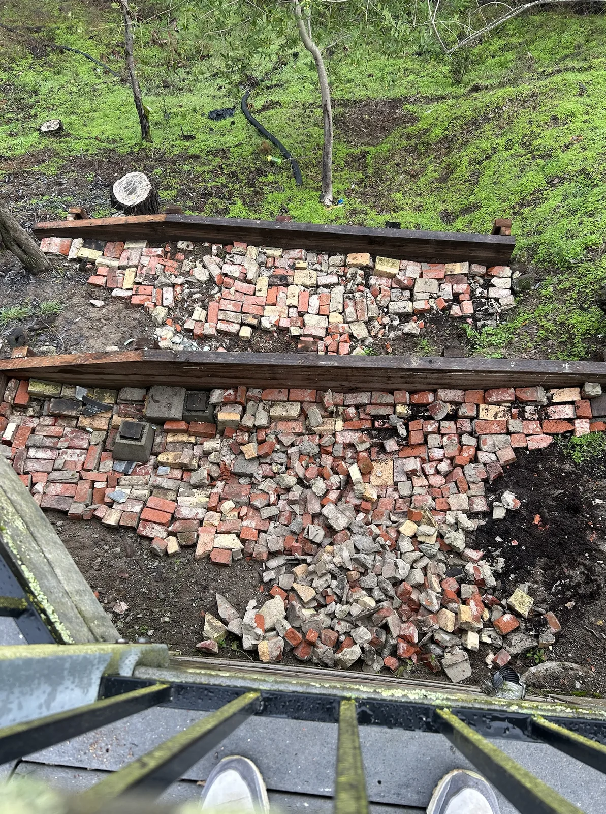

A viral tweet caught my attention as I scrolled Twitter this week. Thanks to a less-than-stellar search function, I can’t find it now, but it lives rent-free in my head today. It suggests our fixation with things like fidget spinners is due to our biological urge for simple, repetitive tasks. It’s interesting that, like dogs that dig and cats that prowl despite their domestic comfort, we’re drawn to the mindless, perhaps a remnant from ages spent chipping stone. There’s a connection between the evolution of the human brain and the need for mental downtime. Einstein found value in menial tasks, freeing his mind to wander and explore. There’s something to that — a way of accessing inspiration, though it’s often as elusive as trying to catch a tiny, floating down feather; the hand that grabs is the same one that pushes it away.

That’s partly why I find value in yard work, but it’s more than that. The rhythmic act of weeding, the fresh air, the sun, and the physical effort all clear my mind and help me shift gear. It’s almost meditative, letting thoughts come and go, observing them without judgment, and often finding clarity or solutions that were once obscured. But there’s another layer to this, something I’ve only felt since taking responsibility for my own land.

In San Francisco, as a tenant, I cared for my flat but never felt it was truly mine. But now, at a ripe old age of thirty-eight, owning a house and 2/3 of an acre in the East Bay, it’s different. This land, cared for by those before me, now relies on me. They built, reinforced, and planted — from pomegranates yielding fruit to manzanitas blossoming with white, teacup-shaped flowers. We’ve added our touch, too, planting blueberries, setting up irrigation, and fortifying the land with retaining walls to combat erosion.

The pile of bricks, remnants of a demolished fireplace, once an eyesore, has taken on new life in those hills, transformed into the backbone of our retaining walls. The daunting task of disposing of this oversized heap loomed for a year, its sheer weight rendering removal a costly ordeal. Then, my wife’s uncle sparked an idea — why not use these bricks to reinforce the hillside, carve out paths for the kids, and, in the process, clear the clutter from our carport?

The solution was simple yet laborious: move the pile, one brick at a time. Over several months, my free time became a ritual of transportation and transformation. I would load up 12 bricks at a time into a wagon, their weight a constant reminder of the task at hand, and wheel them, dozen by dozen, to the hill’s edge. Each brick found its place there, tossed down to become part of something larger, more permanent.

This steady toil, brick by brick, has reshaped the land and our connection to it. Once loose and formless, the earth now holds firm under the weight of our efforts. Paths that once meandered uncertainly through the underbrush now carve clear trails through the hillside, each one a potential adventure for our children, a line drawn between home and the wild creek, between the life we’ve built and the untamed world that lies just beyond our doorstep.

I feel a profound connection to this land in these moments, brick in hand. It’s an ancient, almost sacred act, this tending and toiling. Each brick, each plant, and each moment of effort is a part of something larger. This land, which we’ve shaped and which, in turn, shapes us, isn’t just property. It’s a legacy, a piece of our story, a testament to the stewardship we owe to the earth and our community. It’s sacred, this connection, this responsibility. It’s about honoring the land, improving it, and readying it for the next caretaker. And in that, I find peace, a sense of purpose, and belonging in the simple, timeless act of chipping stone.

