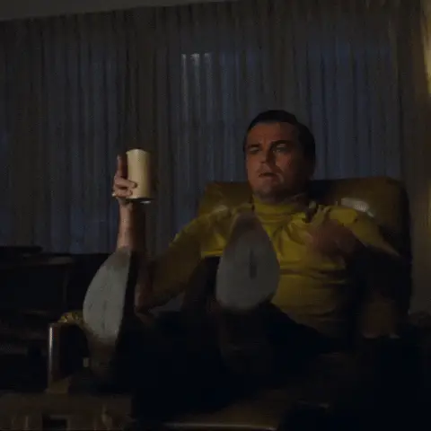
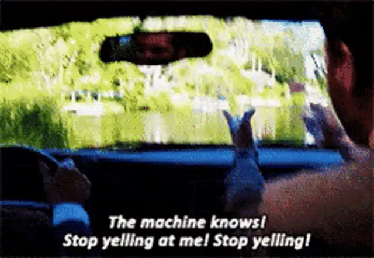
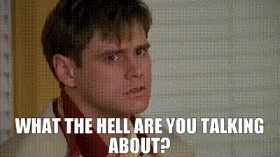

I encountered the concept of “Hyperreality” through a social media post referencing Jean Baudrillard’s influential work “Simulacra and Simulation.” The poster claimed that today’s internet—saturated with stable diffusion-generated images and large language model-created text—was perfectly prophesied by this French philosopher decades ago. Intrigued, I started reading reviews of the book, which consistently described it as simultaneously brilliant and impenetrable—to which I thought, _‘don’t threaten me with a good time, you old post-modernist French Philosopher, you…’_. I later discovered that the book makes a cameo in _The Matrix_ (Neo hollows it out to hide software), which seemed fitting given the film’s exploration of simulated reality, and as a child of the 90s, that did it for me; I need to read this book!

The term “hyperreality ” immediately conjured images of VR headsets, _Blade Runner_, and digital simulations. While these associations are not entirely off the mark, hyperreality is a more profound and pervasive concept.

But what exactly is hyperreality? Put simply, **it happens when the symbols, representations, and simulations we create become more “real” to us than the reality they were initially meant to represent.** Think of it like this: a fast food burger never looks like the glistening, expertly stacked layers of flame-broiled patties, cheese, and vegetable accouterment in the advertisement—but the larger-than-life image in the ad shapes your expectations and experience _more than the actual food does_. Hyperreality is like that.

As I’ll show you in this essay, this phenomenon has existed since ancient times and now permeates virtually every aspect of modern life. Hyperreality is everywhere, from how we interact with social media to our experiences in shopping malls and even how we perceive financial markets. By the end, you’ll recognize hyperreality in your own experiences.

Once you see it, you can’t unsee it.

## I. The Foundation of Hyperreality: Maps and Territories

The concept of hyperreality might seem abstract, but Baudrillard explains it with a surprisingly tangible analogy: a map.

Imagine the process works like this:

1. First, there’s reality—the actual physical territory with all its complexity.
2. We create representations (maps) to help us understand and navigate this reality.
3. Over time, these representations become detached from the reality they were meant to represent, yet they persist and shape our understanding.
4. Eventually, the map becomes more important than the territory—the simulation replaces the real.

Let’s examine this more concretely. Picture an old-fashioned paper map of your city. It shows streets, parks, rivers, and buildings—a simplified representation of the physical space. This map is useful precisely because it isn’t identical to the territory; it emphasizes certain features while ignoring others.

But here’s where it gets interesting: maps also contain elements without direct physical counterparts in the real world. Political boundaries, for instance, aren’t visible lines on the earth’s surface—they exist primarily in our collective imagination and legal systems. Yet, these invisible lines have caused countless wars and shaped human history. For someone who has never visited a distant country, the map they study becomes more “real” to them than the actual place.

You can see this play out in everyday life. Have you ever followed GPS directions that led you into a construction zone or down a road that no longer exists? In that moment, you experience the tension between the map (your GPS) and the territory (the actual road). Most tellingly, many people trust their GPS over their own eyes—”This can’t be right, the app says we should go this way!”

## II. Hyperreality Through History: From Ancient Texts to Digital Worlds

This process of simulation replacing reality isn’t new—it extends to many foundational aspects of human civilization.

Consider religious texts like the Bible. Initially, these were attempts to record events and teachings that people experienced firsthand. Over centuries, however, they evolved into self-referential systems where symbols (the church steeple, organizational hierarchies, elaborate rituals) became increasingly removed from the original experiences they were meant to represent.

This disconnect became so pronounced that it sparked major historical events—the Protestant Reformation emerged mainly as a rejection of what was seen as an overly symbolic Catholic Church that had drifted too far from the simple teachings attributed to Jesus. Martin Luther’s complaints about indulgences (paying the church for forgiveness) represent a classic case of hyperreality: salvation, once understood as a spiritual experience, _had been reduced to a commercial transaction with no necessary connection to genuine spiritual transformation._

The progression of hyperreality has accelerated dramatically over time:

- **Ancient world**: Religious and mythological systems create symbolic representations of natural forces and human experiences
- **Medieval period**: Elaborate religious hierarchies and ceremonies become self-referential systems
- **Industrial age**: Mass reproduction of images and texts creates widespread standardized simulations
- **Television era**: Media events become more significant than the realities they represent
- **Digital age**: Virtual experiences and algorithmic realities become primary rather than secondary experiences

The 2002 film _The Truman Show_ perfectly captures this progression. Truman lives his entire life on a massive television set, with every aspect of his “reality” carefully constructed for an audience. For viewers within the movie’s world, Truman’s life is more real than their own—they structure their days around watching his show and find more meaning in his experiences than in their actual lives. Twenty years later, every person with a smartphone on social media carefully constructs their own “reality” for an audience, assuming the role of both actor and director in their own Truman show.

## III. The Modern Media Landscape: Living in Different Realities

If religion and historical documents represent early forms of hyperreality, modern media have exponentially accelerated and intensified this phenomenon.

Television news offers a perfect case study. When TV broadcasts began, they represented a straightforward attempt to convey real events to viewers. Walter Cronkite’s reporting on the moon landing brought a shared representation of this historic event into millions of homes.

But television gradually transformed from a window on reality to a highly curated performance of reality. Consider how Fox News and CNN might cover the same event differently—the selection of interviews, graphics, framing, and language creates fundamentally different versions of reality for their respective audiences. Over time, each audience begins to believe it has the correct and proper framing of reality and that the other side is wrong, deceitful, or corrupt—hence the increasingly partisan divide over basic civil concepts.

This fragmentation has reached its apex with social media and algorithmic personalization. Today, each person inhabits their own customized information environment. Your Facebook feed doesn’t show you “what’s happening in the world”—it shows you content calculated to keep you scrolling based on your past behavior, creating a reality tunnel unique to you.

A simple experiment demonstrates this: borrow a friend’s phone with different political views and check their social media. You’ll likely feel like you’ve entered a parallel universe, with entirely different events, experts, and frameworks presented as “reality.”

The insidious part is that once these hyperrealities become detached from the world they initially portrayed, the simulation can mask or alter the reality it claims to represent. In this detached state, facts are no longer treated as the primary building blocks of the world—the simulation precedes any facts, and facts are made to fit within the world view offered by the simulation, driving it to become even more detached and self-referential.

## IV. Case Studies in Hyperreality: From Influencers to Financial Markets

### The Instagram Vacation: Performing Experience

Social media platforms like Instagram provide particularly vivid examples of hyperreality in action. In its early days, Instagram was primarily a way for people to share authentic moments. While these images were still curated to some degree, they generally represented actual experiences.

However, a profound shift occurred as the platform evolved and the “influencer economy” emerged. Consider these increasingly hyperreal stages:

1. People initially shared photos of vacations they were already taking.
2. People began choosing vacation destinations that would look good on Instagram.
3. People started planning vacation activities specifically for photo opportunities.
4. Some influencers now visit destinations solely to create content, not to experience the place.
5. At the extreme end, some don’t even travel at all—they rent private jets for photoshoots or use green screens to simulate exotic locations.

The travel industry has adapted accordingly, creating “Instagram museums” and designing hotel rooms specifically for their social media appeal. The result is a self-referential loop: influencers copy other influencers, creating a simulation of a lifestyle that no one actually lives.

You can see this in the remarkable similarity of influencer content—the same poses at the same locations, the same “candid” shots that took 50 attempts to get right. People desire the appearance of an experience rather than the experience itself.

### Financial Markets: When Money Becomes Pure Symbol

For a more profound example of hyperreality, consider our financial system—supposedly the bedrock of our practical, material world.

Money itself has undergone a remarkable transformation. Originally, currency directly represented specific valuable commodities—a gold coin contained actual gold. Later, paper money served as a claim ticket for gold held in reserve. But in 1971, President Nixon ended the convertibility of dollars to gold, and suddenly, currency… still had value?

The symbol remained, now detached from what it once represented. Today, the value of currency is backed primarily by collective agreement and faith in institutions. Money is valuable because we all agree it is—a textbook example of hyperreality.

This abstraction has only accelerated with increasingly complex financial instruments:

- Stocks once represented partial ownership in a company with physical assets and products.
- Derivatives are financial contracts based on the future performance of underlying assets.
- Options on futures contracts are derivatives of derivatives—symbols referring to symbols.
- Credit default swaps are insurance policies on debt, often traded by people who don’t own the underlying debt.

By the 2008 financial crisis, mortgage-backed securities had become so abstracted from the homes and borrowers they represented that even the bankers trading them didn’t fully understand what they were buying and selling.

Cryptocurrency and NFTs represent the purest expression of financial hyperreality. Bitcoin exists entirely in the digital space. During the NFT boom, simple digital images sold for millions of dollars, with value assigned purely through collective belief and speculative fever.

When an NFT of a digital artwork by Beeple sold for $69 million in 2021, it wasn’t because the image file itself (which anyone could view for free) had inherent value—it was valuable because enough people agreed the token representing ownership was valuable. That’s hyperreality in its most distilled form.

## V. Navigating Hyperreality: Why It Matters and What We Can Do

Understanding hyperreality isn’t just a philosophical exercise—it has practical implications for our lives. Baudrillard suggests that hyperreal systems contain the seeds of their own destruction: when people lose faith in the illusion, the system collapses.

Think about how quickly seemingly solid institutions can crumble:

- Financial bubbles burst when market participants panic and withdraw their belief in artificial valuations.
- Social media platforms face “authenticity fatigue” as users grow weary of performative content.
- Political narratives fall apart when enough people stop trusting media representations.

But hyperreality doesn’t simply vanish—it adapts and evolves. When one simulation falls, another typically rises to take its place.

**How can we apply this understanding to our daily lives?**

First, try this simple exercise: For one day, notice how many of your experiences are direct versus mediated. When you check the weather, do you look out the window (direct experience) or check an app (mediated expertise)? When you form an opinion about a public figure, is it based on personal interaction or media representations? You’ll likely be surprised by how much of your “reality” is actually hyperreality.

Second, consider creating deliberate spaces for direct experience. This might mean:

- Occasional digital detoxes
- Engage in activities for their inherent pleasure rather than their “shareability.”
- Seeking out unmediated natural experiences
- Practicing mindfulness to enhance awareness of direct sensory experience

The key insight isn’t that hyperreality is inherently evil. Like technology, it’s a tool that can enhance or diminish human experience depending on how we use it. Sometimes, shared simulations benefit society by creating a common understanding. In other cases, they disconnect us from authentic experiences and meaningful engagement with the world.

## VI. The Future of Hyperreality: From Metaverse to Mind

As technology advances, hyperreality will likely become even more prominent. According to the broligarchy of tech overlords, the “metaverse” represents the logical next step—entire virtual worlds where people work, socialize, and create, potentially spending more time there than in physical reality.

AI-generated content adds another dimension. When you can no longer tell if a human or an algorithm created an image, article, or video, the simulation has reached a new level of sophistication. AI systems trained on existing media are essentially creating simulations based on simulations—copies with no original.

Not everyone agrees with Baudrillard’s pessimistic view of hyperreality. Media theorist Henry Jenkins argues that people aren’t passive consumers of simulations but active participants who remix and reinvent media. Psychologist Sherry Turkle suggests that virtual spaces can provide meaningful experiences and relationships even if they’re mediated.

These perspectives remind us that humans have always lived partly in symbolic worlds of our creation. Stories, myths, and shared beliefs have structured human experience since the beginning of language. What’s new is the intensity, pervasiveness, and technological sophistication of our contemporary simulations.

## Conclusion: Finding Authenticity in a Hyperreal World

Hyperreality surrounds us. From Instagram vacations to algorithm-driven news cycles, we constantly engage with simulations that shape our understanding of reality. But awareness gives us the power to navigate this landscape more intentionally.

The next time you catch yourself in a hyperreal moment—perhaps posting a carefully arranged photo of your “casual” dinner or buying something because you saw an influencer with it—pause and ask yourself:

- What direct experience am I having at this moment?
- What simulation am I participating in?
- Is this enhancing or diminishing my connection to what matters to me?

These questions aren’t about rejecting modern life or technology. Rather, they’re about developing a critical awareness that allows us to move through these overlapping realms of reality and simulation with intention and purpose.

In a world increasingly dominated by copies of copies, authentic experience becomes rare and valuable. The paradox of hyperreality is that becoming aware of it might be our best hope for finding what’s real amidst the simulation.

Once you see hyperreality, you can’t unsee it. But perhaps that awareness itself is the first step toward something more authentic.
