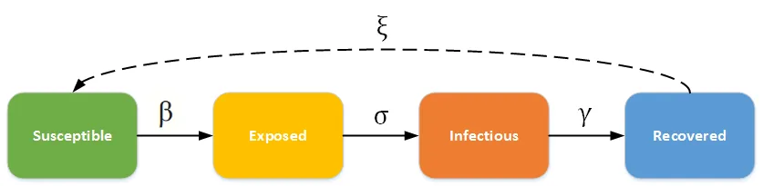
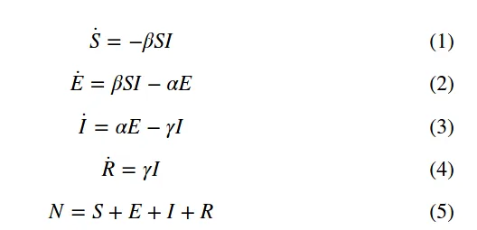
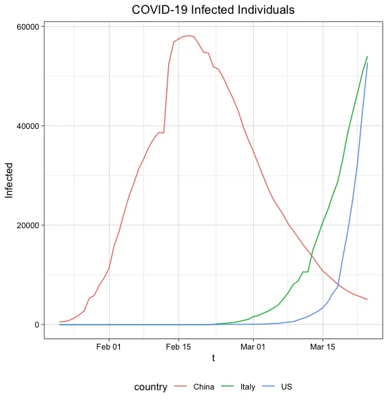
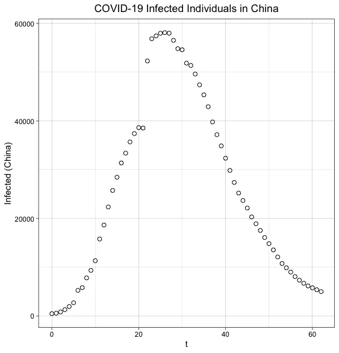
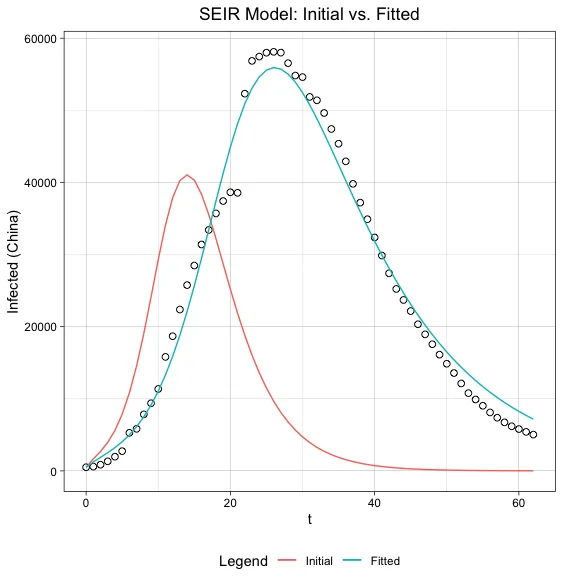
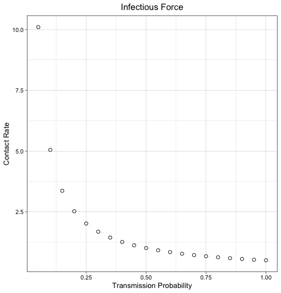
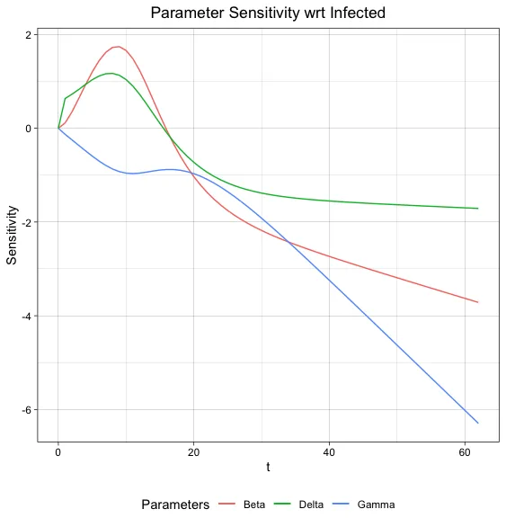
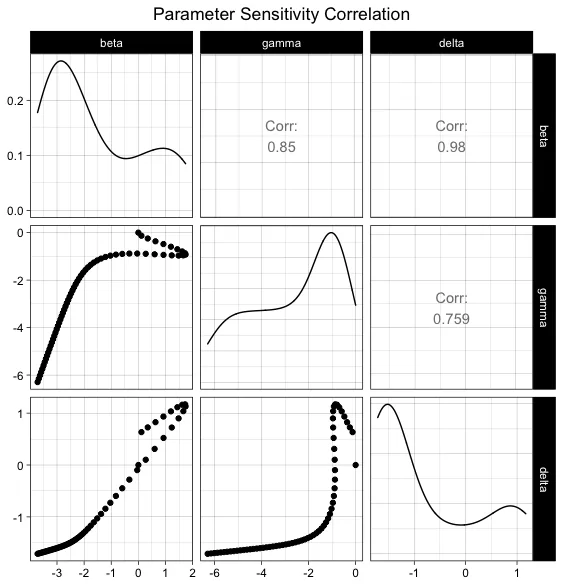
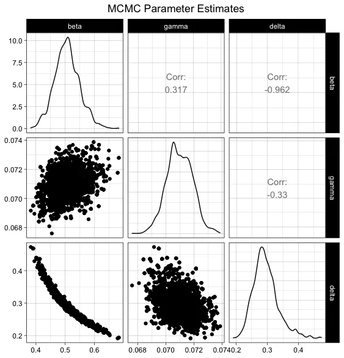
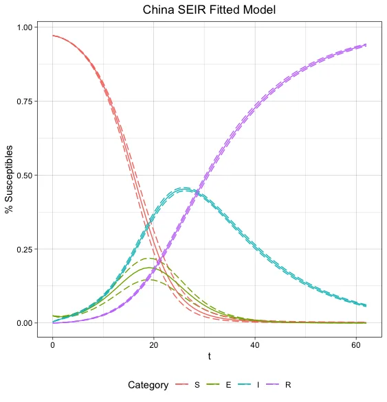

### Introduction

I have mixed feelings about Data Scientists sharing ad-hoc COVID-19 analyses and models across social media.

On the one hand, I’ve seen people fit exponential curves through the data and extrapolate it out a month, giving no consideration to how a virus actually spreads through a population, or people using AutoML (autonomous machine learning) to train models that evaluate wellbut don’t deliver any insight or actionable findings.

On the other hand, I’ve come across many compelling data visualizations and statistical models that effectively communicate the impact of [social distancing](https://www.theatlantic.com/family/archive/2020/03/coronavirus-what-does-social-distancing-mean/607927/), like this nifty simulation by the [Washington Post](https://www.washingtonpost.com/graphics/2020/world/corona-simulator/), or this [article](https://towardsdatascience.com/social-distancing-to-slow-the-coronavirus-768292f04296) by Christian Hubbs that uses an epidemiological model to visualize flattening of the curve.

Considering the state of the world, I wanted to learn more about how to properly make sense of this data, so while in quarantine with my wife and two kids, I read up on epidemiological models and tried applying my learnings to [John Hopkins University’s](https://coronavirus.jhu.edu/) open COVID-19 dataset.

My intent here is for my own edification. I will not extrapolate any findings or make predictions about the final number of confirmed cases or deaths. I don’t claim to be an expert in this field, and none of this has been peer reviewed yet, so please question every bit of it.

## Summary

By modeling the number of COVID-19 infections over time with an SEIR epidemiological model, I was able to estimate population and system dynamic parameters, such as 1) contact rate between individuals, 2) transmission probability of the virus, 3) reproductive rate of the virus, 4) incubation rate (or, time from exposure to becoming infectious), and 5) recovery rate (or, time from infection to recovery).

Using only the total number of COVID-19 infections, the model gives the following estimates of the epidemic as  it occurred in China:

1. **Contact rate** = Between 7 and 10 people, depending on the transmission rate.
2. **Infectious period** = 14 days
3. **Incubation period** = 3.5 days
4. **Reproductive rate** = 7.1

---

According to the chief epidemiologist of the [Chinese Centers for Disease Control and Prevention](https://www.the-hospitalist.org/hospitalist/article/218769/coronavirus-updates/covid-19-update-transmission-5-or-less-among-close), at the outset of the epidemic, the transmission rate of COVID-19 was 10% among family members and 1%-5% among people who came in close contact with infected patients. Assuming a transmission rate somewhere between 5%-10%, an infected person would need to **come in close contact** **with between 7 and 10 people per day.**

The estimated **infectious period** **of 14 days** aligns reasonably well with the of the CDC’s upper-bound of the time that it takes a person to become symptomatic (between 2 and 14 days), which was a nice result to get.

The estimated **incubation period** **of 3.5 days** is a measure I cannot find evidence to support or refute. If you happen to know of any research on the incubation rate of COVID-19, please reach out to me.

The estimated **reproductive rate** **of 7.1**is nearly three times what the CDC estimates. I haven’t been able to resolve this discrepancy, yet interestingly, I found an article from the [Journal of Travel Medicine](https://academic.oup.com/jtm/advance-article/doi/10.1093/jtm/taaa030/5766334) that measured the reproductive rate (without any interventions) on the Diamond Princess Cruise Ship at a whopping 14.8! The number was revised to 1.8 after including interventions like isolation and quarantine – and so I suspect my model is simply more naive than what the professionals are using.

## The SEIR Model

SEIR stands for **S**usceptible, **E**xposed, **I**nfected, **R**ecovered. The model is described by the rates of change in which individuals move from, at first being susceptible to a virus, to exposed, then infected, and finally recovered.





Equations _1 – 4_ describe the rate of change for each category. If we want to calculate S, E, I, or R at some time _t_, then we need to solve a set of differential equations. Note that a model defined by a set of differential equations is conditioned by the initial values of S, E, I, and R at time = 0.

In addition to the initial conditions, three parameters define the rates of change between patient condition categories in the model.

- _β_ is the _transmission rate_
- γ is the _recovery rate_
- α is the_incubation rate (note, the notation I will use for this parameter is_𝛿)

---

To calculate _β_, γ, and 𝛿 we need to make four assumptions about the dynamics between a population and the virus:

1. Contact rate between individuals,
2. Transmission probability of the virus upon contact,
3. The infectious period of the virus within an individual
4. The latent period of the virus, or, the time from when a person contracts the virus to when they become infectious.

If we make some assumptions about these four measures, then we can calculate model parameters _β_, γ, and 𝛿 as:

---

```
beta = contact_rate * transmission_probability
gamma = 1 / infectious_period
delta = 1 / latent_period
```

---

An interesting parameter that falls out based on our assumptions is R0 (R naught), the _reproductive number_. It estimates the number of secondary cases that stem from a single infected individual. For example, if R0 is two, then each infected person infects about two other people before recovering. The reproductive number is essentially a measure of virality and how quickly a virus can spread within a population.

Depending upon the epidemiological model, the method to calculate R0 varies, but for the relatively straightforward model we are using it generalizes nicely to:

---

```
R0 = beta / gamma
```

---

Many of the initial conditions and model parameters cannot be measured, or they may be completely unknowable. For example, the John Hopkins data has “confirmed cases” (e.g. “infected individuals”), but it does not have “susceptible” or “exposed” individuals, because we can’t measure those things in practice. Similarly, we may have some research that supports a strong belief about the infectious period, because that measurement is better suited to a controlled experiment. Still, something like the transmission probability may be a factor of many different social or environmental causes and vary from region to region. In essence, somethings, we can only have a belief or make an assumption about.

## Inverse Modeling COVID-19

The hypothesis I want to test is that the number of infected individuals in China can be described over time using an SEIR model. But what if instead of _working forward_ by making some (possibly arbitrary) assumptions about initial conditions and model parameters, we _worked backward_ by deriving the initial conditions and optimal set of model parameters that best describe some data?



A quick plot of infected individuals by the three countries that are making COVID-19 headlines shows how the virus has spread. At any given time, different countries exist in different parts of the “infection curve.” Since patient zero was in Wuhan, China, it makes sense that a complete curve is from China, where the spread of the virus has, _based on available data_, plateaued.

Since the goal is to identify optimal model parameters (_β_, γ, and 𝛿) that fit a COVID-19 infection curve, I will limit this analysis to China only, since it represents the most complete infection curve.

## **Preliminary Research**

Having formulated the hypothesis that the infection curve of COVID-19 in China can be described using an SEIR model, I started researching how others have solved similar problems. I don’t want to reinvent the wheel, so I started Googling things like “inverse modeling differential equations.” Luckily for me, I stumbled upon an R library named [FME](https://cran.r-project.org/web/packages/FME/vignettes/FME.pdf) that does precisely that! From one of their R vignettes:

_“Mathematical simulation models are commonly applied to analyze experimental or environmental data and eventually to acquire predictive capabilities. Typically these models depend on poorly defined, unmeasurable parameters that need to be given a value. Fitting a model to data, so-called inverse modeling, is often the sole way of finding reasonable values for these parameters. There are many challenges involved in inverse model applications, e.g., the existence of non-identifiable parameters, the estimation of parameter uncertainties, and the quantification of the implications of these uncertainties on model predictions.”_

Well, that’s what I want to do. Perfect!

Having identified my hypothesis and a library that supports the task, it’s time to blow the dust of my R Studio install and start modeling!

## Model Definition

The first step is to define an SEIR function consistent with the model described above.

---

```
SEIR <- function (pars, S_0 = 120000, E_0 = 3000, I_0 = 500, R_0 = 0) {

  derivs <- function (time, y, pars) {
  with (as.list(c(pars, y)), {
      dS <- (-beta * S * I)
      dE <- (beta * S * I) - (delta * E)
      dI <- (delta * E) - (gamma * I)
      dR <- (gamma * I)

  return(list(c(dS, dE, dI, dR), infected = I * N))
  })
  }

  # calc. total population
  N <- S_0 + E_0 + I_0 + R_0

  # initial conditions
  y <- c(S = S_0/N, E = E_0/N, I = I_0/N, R = R_0/N)

  times <- seq(0, 58, by=1)
  out <- ode(y = y, parms = pars, times = times, func = derivs)

  as.data.frame(out)
  }
```

---

The `SEIR` function is defined with some initial conditions, `S_0, E_0, I_0, R_0`, and an object `derivs` containing the derivatives of variables S, E, I, and R with respect to time.

The heavy lifting is performed by the `ode` method, which stands for “ordinary differential equation.” It takes some dependent variable `y` (here it is the incidence rates of S, E, I, and R), the derivative of `y` with respect to time, some model parameters (_β_, γ, 𝛿), and a sequence of times. The set of differential equations is then solved, and we return a dataframe of all S, E, I, R incidence rates over time.

## **Parameter Optimization with FME**

To run the optimization algorithm and find an optimal set of model parameters, we need to first set some, e.g., any parameters. These assumptions are just the starting point for the optimization algorithm; they are not that important.

---

```
# population & virus assumptions
contact_rate = 10                     # number of contacts per day
transmission_probability = 0.10       # transmission probability
infectious_period = 5                 # infectious period
latent_period = 2                     # latent period

# beta (tranmission rate), gamma (recovery rate), and delta (incubation rate)
beta_value = contact_rate * transmission_probability
gamma_value = 1 / infectious_period
delta_value = 1 / latent_period

# Ro (reproductive rate)
Ro = beta_value / gamma_value

# model hyperparameters
pars = c(beta = beta_value, gamma = gamma_value, delta = delta_value)
```

---

Lastly, we need to define the cost function relating the model parameters to the model output. The FME library has a `modcost` function that handles updating the residual error for each iteration of the optimization run.

---

```
SEIRcost <- function(pars) {
  out <- SEIR(pars = pars)
  return(modCost(model = out, obs = ChinaInfected, err = "sd"))
  }
```

The FME function `modFit` does a lot of sophisticated optimization under the hood. If you’re interested, check out their vignettes for more information; the authors have written them very well. Luckily for me, their API is as simple as:

---

```
Fit <- modFit(f = SEIRcost, p = pars)
```

---

And that’s it! We’ve written all the code we need to inversely model a set of optimal SEIR parameters to fit the observed infection curve for China. When we call `modFit` on `SEIRcost` with some initial parameters, `pars`, the algorithm will optimize parameters _β_, γ, 𝛿 in such a way to minimize the error between our SEIR model and the following data points:



So how well does an SEIR model the COVID-19 infection curve for China? Below is a graph comparing the initial curve, based on some arbitrary assumptions, to the fit curve, after parameter optimization. Visually, the fit curve does a decent job of describing the observed data. It’s a little underestimated at the peak and overestimated at the tail, but it appears to do a pretty good job.



To retrieve the parameter values of the fit curve, we call `coef`.

```
coef(Fit)

beta       gamma       delta
0.50510    0.07098     0.28953
```

And there we have it, the parameter values of _β_, γ, 𝛿 that give an optimal SEIR model on China’s confirmed COVID-19 infections data.

## Reasoning about Model Parameters

With a set of optimal parameters _β_, γ, and 𝛿 identified, we can now reason about model assumptions that we otherwise would have had to rely on some combination of research, intuition, or good-old-fashioned guessing to set.

**Beta**

Recall that _β_ is the transmission rate. It is calculated as the product of the contact rate between people and the probability of virus transmission from an infected person to a susceptible person, upon contact.

With an estimate of _β_ = 0.505, we can explore the related contact rates at different transmission probabilities. The relationship between these two variables is plotted below, giving a visual indication of the tradeoff between how many people the average person comes into contact with as it relates to the virus’s likelihood of being transmitted. It’s basically the infectious force of the virus at _β_ = 0.505 across two dimensions that are very challenging to measure in practice.

<figure>
<p> </p>
<figcaption>If the transmission probability is 5%, or about 1 out of every 20 people exposed to an infected person also gets infected, then the average contact rate would need to be about ten people to generate an infection curve like the one we see for China.</figcaption>
</figure>

**Gamma**

The recovery rate, γ, is defined as:

---

```
gamma = 1 / infectious_period
```

---

Since we have an estimate that γ = 0.071, we can solve for the infectious period, or, for how long an infected individual is contagious. Solving for the infectious period, we estimate that an individual is contagious for approximately 14 days. This estimate is well-aligned with the upper-bound of the CDC’s estimates of 2 – 14 days for a person to show symptoms of COVID-19.

**Delta**

The incubation rate, 𝛿, or the rate at which an exposed individual becomes infectious, is defined as:

---

```
delta_value = 1 / latent_period
```

---

Solving for the latent period using 𝛿 = 0.290, we estimate that a susceptible individual could be exposed to COVID-19, but not become infectious for more than three days.

**Reproductive Number**

The model that we fit estimates _β_ = 0.505 and γ = 0.071, which yields an R0 of 7.1, more than three times greater than what most health organizations and academic researchers estimate it to be.

## Parameter Sensitivity Analysis

FME contains a handy function called `sensFun` that estimates the sensitivity of the model output (infections) relative to the parameter values.

When applied to the observed data, these sensitivity functions help identify important parameters based on the absolute magnitudes of the sensitivity summary values. We can even use this method to rank the importance of parameters on the number of infected individuals in China at some time _t_.



In the very early stages of the epidemic, the incubation rate, 𝛿, has the most significant effect on the spread of the virus. Intuitively this makes sense since this parameter controls the latency between when an infected person contracts the virus and when they become contagious.

What is interesting is that very shortly after that, _β_, the transmission rate, overcomes 𝛿 as the parameter of the greatest effect. Intuitively it makes sense that _β_ would have a significant impact on the infection curve, for it is, after all, the rate at which the virus is transmitted.

Because we’re using a relatively simple SEIR model where people do not reenter the susceptible population after recovering, once the infection curve peaks, both 𝛿 and _β_ drop in their overall effect on the total number of infections. This makes sense considering the pool of potential people that can be exposed to the virus only shrinks over time.

The recovery rate, γ, has the least effect on the rate at which infections spread, which also makes sense given the model we are using, where people do not reenter the susceptible population once recovered. If we used an epidemiological model where there was a cycle between recovery and susceptibility, then γ would have a more significant effect, because the shorter the recovery time, the faster the susceptible population would be replenished to feed back into the infection curve.

The below graph shows the correlation between parameter sensitivities. We see that generally, they are positively correlated, meaning that the parameters change in similar directions as it relates to their effect on the number of infected people. For example, at the beginning of the epidemic, both 𝛿 and _β_ have an increasing effect on the spread of the virus. Once it reaches a critical capacity, they then both have a diminishing effect.



## **Bayesian Methods**

Having identified a set of optimal, discrete parameters, I will now explore the data-dependent probability distribution of the parameter space. We will estimate the probability distribution around each parameter (the marginal probability) as well as the probability distributions between parameter estimates (the joint probabilities).

### MCMC

The function `modMCMC` implements a Markov chain Monte Carlo (MCMC) method to sample from probability distributions by constructing a Markov chain with the desired distribution, and building a posterior distribution about the parameter space.

---

```
MCMC <- modMCMC(f = SEIRcost, p = Fit$par, niter = 2000, jump = cov0,
                var0 = var0, wvar0 = 0.1, updatecov = 50)
```

---

Calling `pairs(MCMC, nsample = 1000)` on the MCMC object yields a pair plot showing the pairwise relationship between parameter values.

<figure>
<p> </p>
<figcaption>The pairwise relationship is shown in the lower panels, the correlation coefficients in the upper panel, and the marginal distribution for each parameter on the diagonal.</figcaption>
</figure>

The marginal probabilities estimate the range and likelihood of values for each parameter. You can see that _β_ is likely to range anywhere from 0.40 to 0.65, but is most likely near 0.50, while γ is likely constrained to a range of somewhere between 0.068 and 0.074.

The strong negative correlation between _β_ and 𝛿 is a product of their proximity in the SEIR flow diagram and a consequence of the tradeoff between the rate at which a virus is transmitted, and the time it takes for a person to become infectious. To fit a curve through the observed data, the higher the transmission rate, the longer the virus can incubate, but as the transmission rate drops, the incubation rate needs to increase if we are to still to fit the curve.

## Final SEIR Model

By inversely modeling a system of differential equations and using Bayesian methods to construct a posterior belief about the likelihood of possible parameter values, a final SEIR model emerges.

The below graph shows the rate of incidence of susceptibles, exposed, infected, and recovered individuals over time in China, with 90% confidence bounds.

<figure>
<p> </p>
<figcaption><span data-preserver-spaces="true" style="color: #0e101a; background-position: initial; margin-top: 0pt; margin-bottom: 0pt;">Note the most uncertainty in this model is about the </span><strong style="color: #0e101a; background-position: initial; margin-top: 0pt; margin-bottom: 0pt;">E</strong><span data-preserver-spaces="true" style="color: #0e101a; background-position: initial; margin-top: 0pt; margin-bottom: 0pt;">xposed incidence rate. My intuition is that the </span><strong style="color: #0e101a; background-position: initial; margin-top: 0pt; margin-bottom: 0pt;">S</strong><span data-preserver-spaces="true" style="color: #0e101a; background-position: initial; margin-top: 0pt; margin-bottom: 0pt;">usceptible, </span><strong style="color: #0e101a; background-position: initial; margin-top: 0pt; margin-bottom: 0pt;">I</strong><span data-preserver-spaces="true" style="color: #0e101a; background-position: initial; margin-top: 0pt; margin-bottom: 0pt;">nfected, and </span><strong style="color: #0e101a; background-position: initial; margin-top: 0pt; margin-bottom: 0pt;">R</strong><span data-preserver-spaces="true" style="color: #0e101a; background-position: initial; margin-top: 0pt; margin-bottom: 0pt;">ecovered rates become relatively well defined given the shape of the infection curve we are fitting a model against. The </span><strong style="color: #0e101a; background-position: initial; margin-top: 0pt; margin-bottom: 0pt;">E</strong><span data-preserver-spaces="true" style="color: #0e101a; background-position: initial; margin-top: 0pt; margin-bottom: 0pt;">xposed rate, however, has a larger potential for a tradeoff between things like contact rate, transmission rate, and incubation rate, which creates latency between exposure and becoming infectious allowing for many more potential exposure scenarios that would still adequately describe the data.</span></figcaption>
</figure>
