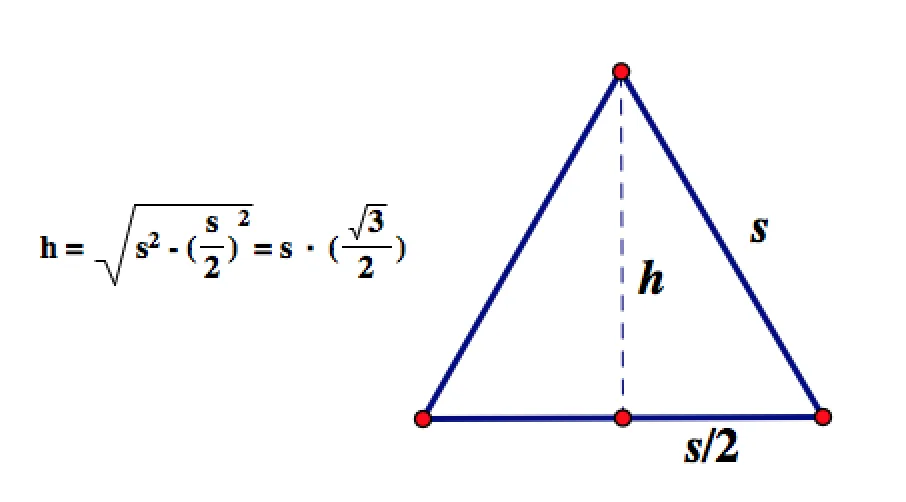
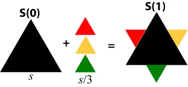
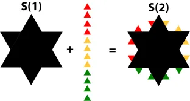
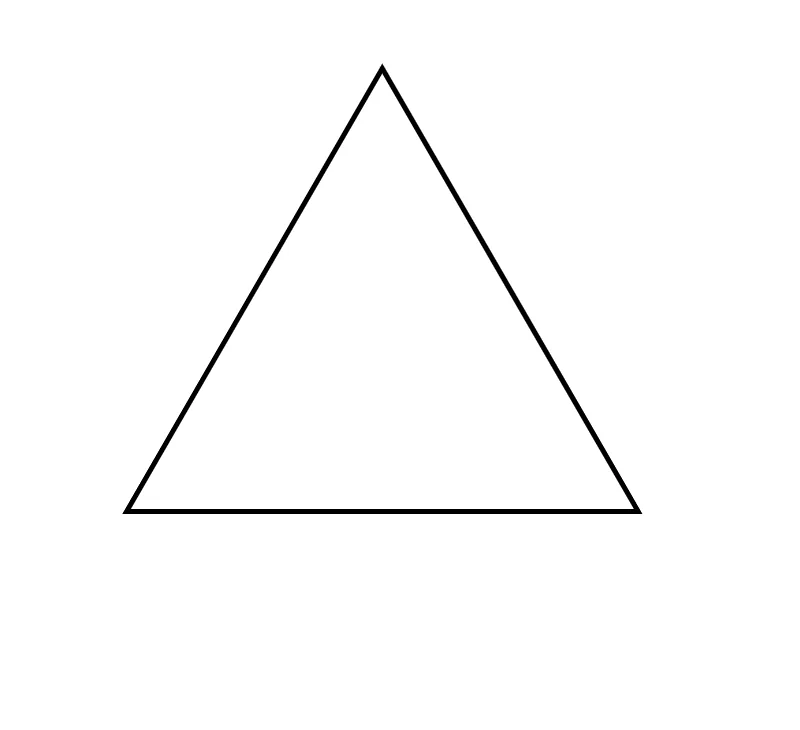
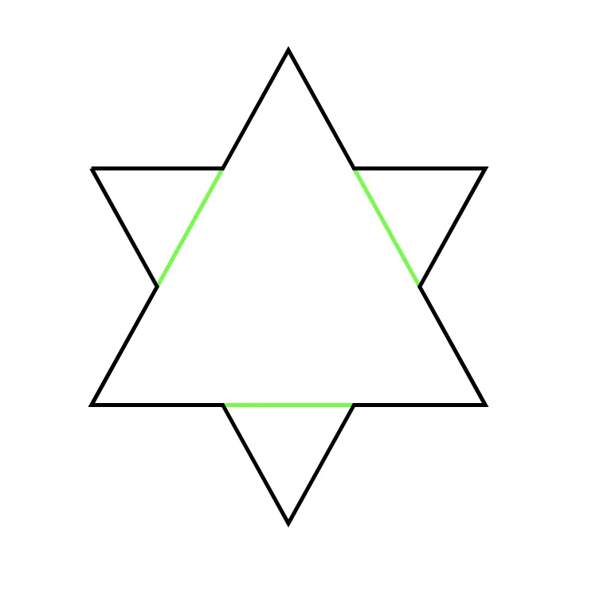
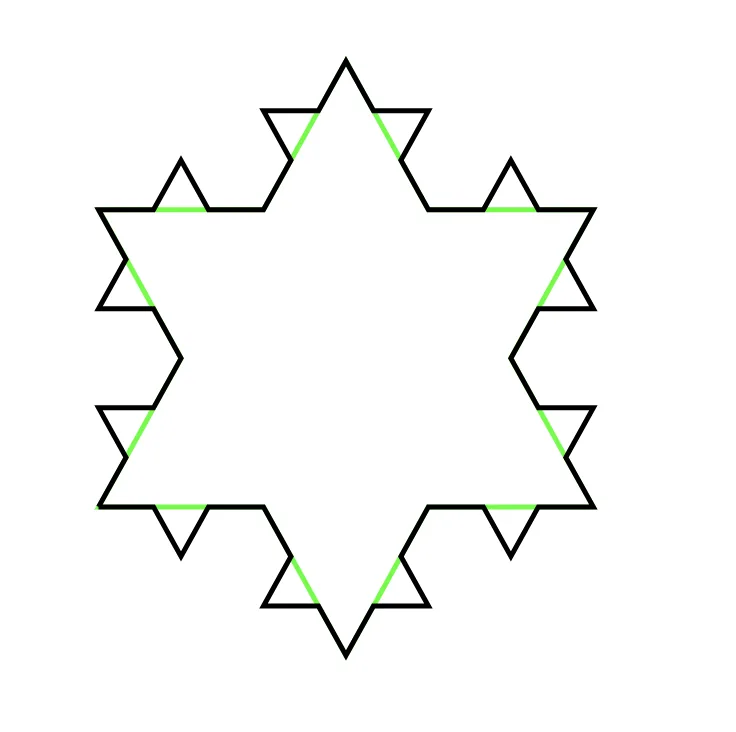

Intuition has often led me astray, but (luckily?) never more than when studying mathematics. Koch’s Snowflake is that reminder for me.

Koch’s Snowflake is a [fractal](https://mathworld.wolfram.com/Fractal.html), a class of complex geometric shapes that display self-similarity on all scales. It is “grown” from a single equilateral triangle. At each stage in growth, equilateral triangles of diminishing size are appended to every side. As the number of iterations increases, the shape converges to a six-sided crystalline shape – hence a _snowflake_.

Honestly, it’s easier to draw than describe.

Below are the first six iterations of Koch’s snowflake. Assuming a side length of 1, you can see the area, $A_{n}$, and the perimeter, $P_{n}$, as the number of iterations, $n$, increases.

<video controls="" src="media/koch-snowflake-1-3.mp4"></video>

$n = 1$

$A_{1} = 0.577$

$P_{1} =  3.000$

<video controls="" src="media/koch-snowflake-2-2.mp4"></video>

$n = 2$

$A_{2} = 0.642$

$P_{2} = 4.000$

<video controls="" src="media/koch-snowflake-3-1.mp4"></video>

$n = 3$

$A_{3} = 0.670$

$P_{3} = 5.333$

<video controls="" src="media/koch-snowflake-4-1.mp4"></video>

$n = 4$

$A_{4} = 0.683$

$P_{4} = 7.111$

<video controls="" src="media/koch-snowflake-5-1.mp4"></video>

$n = 5$

$A_{5} = 0.688$

$P_{5} = 9.481$

<video controls="" src="media/koch-snowflake-6-1.mp4"></video>

$n = 6$

$A_{6} = 0.691$

$P_{6} = 12.64$

---

Now get this. As the number of iterations $n$ approaches infinity, the area $A_{n}$ is bounded but the perimeter $P_{n}$ diverges to infinity. So, the perimeter can be made arbitrarily large while _at the same time_ the area can never grow beyond some fixed limit… if intuitively you’re cool with that, congratulations, you have better intuition than me.

When I first encountered Koch’s Snowflake, I was certain that if the area was bounded, then the perimeter must be bounded too. Intuitively, it just made sense; they _literally_ define each other. But my gut was wrong. Even after working through the math – which is detailed below if you’re feeling _mathy_ – I still struggle to wrap my head around what. is. even. going. on.

## The Area of Koch’s Snowflake

Let $A_{i}$ denote the area of the $i^{th}$ iteration of Koch’s Snowflake.

The area of a triangle is given by $\frac{1}{2}(b)(h)$, so assuming an equilateral triangle of side length $s$, it follows that:

$A_{0} = \frac{1}{2} (s) (s (\frac{\sqrt{3}}{2}))$

$A_{0} = s^2(\frac{\sqrt{3}}{4})$

The next iteration of the fractal is equal to $A_{0}$ plus the incremental area of the three additional new triangles. Note that, the way the fractal transformation is defined, every side length is equal to $\frac{1}{3}$ the length of the original side $s$. Therefore, $A_{1}$ is equal to:

---

---

$A_{1} = A_{0} + 3 \cdot (\frac{s}{3})^2(\frac{\sqrt{3}}{4})$

$A_{1} = s^2(\frac{\sqrt{3}}{4}) + 3 \cdot (\frac{s}{3})^2(\frac{\sqrt{3}}{4})$

$A_{1} = s^2(\frac{\sqrt{3}}{4}) (1 + \frac{3}{9})$

Continuing to recursively calculate the area of Koch’s Snowflake in this manner, and then simplifying the expression, the pattern becomes clear. _The derivation of the following expressions is left to the reader_.

---

---

$A_{2} = s^2(\frac{\sqrt{3}}{4}) (1 + \frac{3}{9} + \frac{3(4)}{9^2})$

$A_{3} = s^2(\frac{\sqrt{3}}{4}) (1 + \frac{3}{9} + \frac{3(4)}{9^2} + \frac{3(4^2)}{9^3})$

Let’s reflect for a minute on what is occurring in the parentheses of summands in the formula above. Each summand is equal to the number of additional triangles, $3(4^{i-1})$, times their respective area, $(\frac{s}{3^i})^2 (\frac{\sqrt{3}}{4})$, at the $i^{th}$ iteration. Using this, we can calculate the incremental area added at the $i^{th}$ iteration as the product of additional triangles by their respective area, which algebraically simplifies to:

$3(4^{i-1}) \cdot (\frac{s}{3^i})^2 (\frac{\sqrt{3}}{4}) = s^2 (\frac{\sqrt{3}}{4}) ((\frac{3(4^{i-1})}{9}))$, for side length $s$.

So, we can generalize the total area of Koch’s Snowflake at the $n^{th}$ iteration to:

$A_{n} = s^2 \frac{\sqrt{3}}{4} (1 + \sum_{i=1}^{n} \frac{(3(4^{i-1}))}{9^i})$

So what happens to $A_{n}$ as $n$ approaches infinity? To answer this question we need to know about geometric series and their properties.

#### Aside: Geometric Series

A geometric series is a series of the form $S_{\infty} = \sum_{n=1}^{\infty} ar^n$, which expands to:

$S_{\infty} = ar^0 + ar^1 + ar^2 + ...$

Note that, if we multiply the above expression by $r$, we have:

$(r) S_{\infty} = ar^1 + ar^2 + ar^3 + ...$

Multiplying by $r$ may seem arbitrary, but considering the expression $S_{\infty} - (r) S_{\infty}$ we see that every term except $ar^0$ cancels, thereby transforming an expression of two infinite series into a simple finite expression. It’s clever, that’s for sure.

**INSERT:** math showing cancellation of infinite series

And we have:

$S_{\infty} - (r) S_{\infty} = ar^0 = a$

$S_{\infty} (1 - r) = a$

$S_{\infty} = \frac{a}{1 - r}$, for $-1 < r < 1$

**TODO:** prove for -1 < r < 1

So not only does a geometric series converge if  $-1 < r < 1$, it converges to $\frac{a}{1 - r}$.

We will express the perimeter of Koch’s Snowflake, $A_{n}$, as a geometric series and show that $-1 < r < 1$, therefore it converges to $\frac{a}{1 - r}$.

**Proof**

To prove $A_{n}$ converges to some real number, we only need to consider the infinite sum within the expression, since everything else is constant.

$\frac{3(4^{n-1})}{9^n} = \frac{3(4^{n-1})}{9(9^n-1)} = (\frac{3}{9}) (\frac{4}{9})^{n-1}$

Which is a geometric series with $a = \frac{3}{9}$ and $r = \frac{4}{9}$, and since $r < 1$ it converges. Using the identity of the geometric series derived above, $S_{\infty} = \frac{a}{1 - r}$ it follows that:

$\lim_{n\to\infty} A_{n} = s^2 \frac{\sqrt{3}}{4} (1 + \sum_{n=1}^{\infty} \frac{(3(4^{n-1}))}{9^n}))$

$A_{n} = s^2 \frac{\sqrt{3}}{4} (1 + \frac{\frac{3}{9}}{1 - \frac{4}{9}})$

$A_{n} = s^2 \frac{\sqrt{3}}{4} \frac ({8}{5}) = s^2 \frac{2\sqrt{3}}{5}$

Therefore, the area of Koch’s Snowflake converges to $s^2 \frac{2\sqrt{3}}{5}$ for side length $s$.

$\blacksquare$

## The Perimeter of Koch’s Snowflake

At each iteration in the fractal, all incremental side lengths are equal. Therefore, the perimeter of Koch’s Snowflake at the $i^{th}$ iteration is given by, $P_{i} = s_{i} (l_{i})$, for $s$ the number of sides and $l$ the length of each side.

**The Number of Sides**

$n = 0$

$s_{0} = 3$

$l_{0} = 1$

$n = 1$

$s_{1} = (4)(3)$

$l_{1} = (\frac{1}{3})$

$n = 2$

$s_{2} = (4)(4)(3)$

$l_{2} = (\frac{1}{3})(\frac{1}{3})$

It appears that $s$ generalizes to $s_{i} = 4^i(3)$ and $l$ generalizes to $l_{i} = (\frac{1}{3})^i$. Therefore:

$P_{n} = s_{n} (l_{n}) = 4^n(3)(\frac{1}{3})^n$

So what happens to the perimeter, $P_{n}$, as $n$ approaches infinity? Mathematically, we would like to evaluate the following expression:

$\lim_{n\to\infty} 4^n(3)(\frac{1}{3})^n$

$3 \cdot \lim_{n\to\infty} (\frac{4}{3})^n$

Note that we can pull the constant out of the limit, and so we are really only interested in what $(\frac{4}{3})^n$ does as  $n$ approaches infinity. To answer this, we will need to know about Cauchy sequences and their properties.

#### Aside: Cauchy Sequences

A sequence is Cauchy if we can always find two points that are arbitrarily close. It’s just another way of defining a convergent sequence, and in fact, a sequence is Cauchy _if and only if_it converges to some $r \in \mathbb{R}$.

Formally, a sequence $S$ is Cauchy if there exists $N \in \mathbb{N}$ such that for $m, n > N$, $|S_{n} - S_{m} | < \epsilon$ for all $\epsilon > 0$.

We rely on the fact that a sequence is Cauchy _if and only if_it converges to some $r \in \mathbb{R}$ to demonstrate that the perimeter of Koch’s Snowflake, $P_{n}$, _is not convergent_. This is accomplished by assuming that $P_{n}$ _is convergent_, then reaching a contradiction in demonstrating it is also a Cauchy sequence, therefore, $P_{n}$ must diverge.

**Proof**

Assume that $P_{n} = (\frac{4}{3})^n$ converges to some $A \in R$. Then it follows that $P_{n}$ is a Cauchy Sequence, and there exists $N \in \mathbb{N}$ such that for $m, n > N$, $|P_{n} - P_{m} | < \epsilon$ for all $\epsilon > 0$.

Choose $\epsilon = \frac{1}{3}$ and let $m = n + 1$. If the sequence is Cauchy, then we should be able to find $N$ such that for $m, n > N$:

$|P_{n} - P_{m} | < \epsilon = \frac{1}{3}$.

_The choice of $\epsilon$ is not arbitrary here, nor is the choice of $m = n + 1$, as you will soon see._

Then it follows that:

$|P_{n} - P_{m}| < \epsilon = \frac{1}{3}$

$|(\frac{4}{3})^n - (\frac{4}{3})^m | < \epsilon = \frac{1}{3}$

$|(\frac{4}{3})^n - \frac{4}{3}(\frac{4}{3})^n| < \epsilon = \frac{1}{3}$

$|(\frac{4}{3})^n (1 - \frac{4}{3}) | < \epsilon = \frac{1}{3}$

$|(\frac{4}{3})^n (-\frac{1}{3})| < \epsilon = \frac{1}{3}$

Which, because we are taking the absolute value, is equivalent to:

$|(\frac{4}{3})^n(\frac{1}{3})| < \epsilon = \frac{1}{3}$

Which cannot be possible, because $(\frac{4}{3})^n > 1$ for all $n$, and $\frac{1}{3}$ multiplied by any number greater than $1$ must be greater than $\frac{1}{3}$, therefore, there is no $N$ such that for $m, n > N$ it is true that $|P_{n} - P_{m} | < \epsilon = \frac{1}{3}$.

$\blacksquare$

A convergent sequence generates points that get arbitrarily close, but we have shown that no matter how far out we go there does not exist any two points whose distance is less than $\frac{1}{3}$. This implies that the gaps between elements do not fade to zero. Intuitively, if the distance between points does not diminish then we can continue adding elements of the sequence to reach any arbitrarily large number, larger than $10^{1,000}$, or $10^{10,000}$, or $10^{100,000}$.
