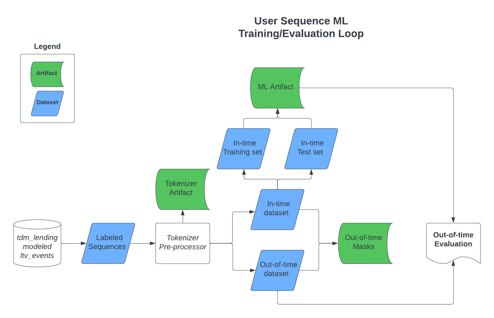

In machine learning, when we work with data that changes over time, like sales numbers that are recorded every day, it’s important to think carefully about how we use this data to train our models and check how well they’re doing.

Think of the model as a person trying to predict the next part of a story based on all the previous chapters. To see how good their guess is, they compare it to the actual next chapter once it’s available. This is similar to how we test our models. We use data from the past and present (what we call the “in-time dataset”) to train them, and then we test them with new, future data (the “out-of-time dataset”) to see how well they predict.

But here’s a tricky part: Should we use all of the in-time data for training and save the out-of-time data just for testing? Or should we split the in-time data further for more detailed testing and fine-tuning?

_**Data Flow Diagram of Temporal Data ML Training/Evaluation Loop**_

The key is to avoid using any future (out-of-time) data for model tuning _prior to evaluation_. If we do that, it’s like cheating by peeking into the future, which can mislead us about how good our model really is. We need to keep our training process honest by not letting it ‘see’ the future data.

After training our model with the in-time data, we first check how it’s doing with a part of that in-time data that we set aside. This is like a practice test. It helps us understand how healthy our model is. Then, the real test comes when we use the out-of-time data. This final step is crucial because it shows us how well our model can handle new, unseen data. It’s like the final round in a competition, deciding how strong and reliable our model is.

By following this process, we make sure our models are well-prepared to make predictions about the future, based on the data they were trained on. This approach helps us create models that are more accurate and trustworthy in real-world situations.
