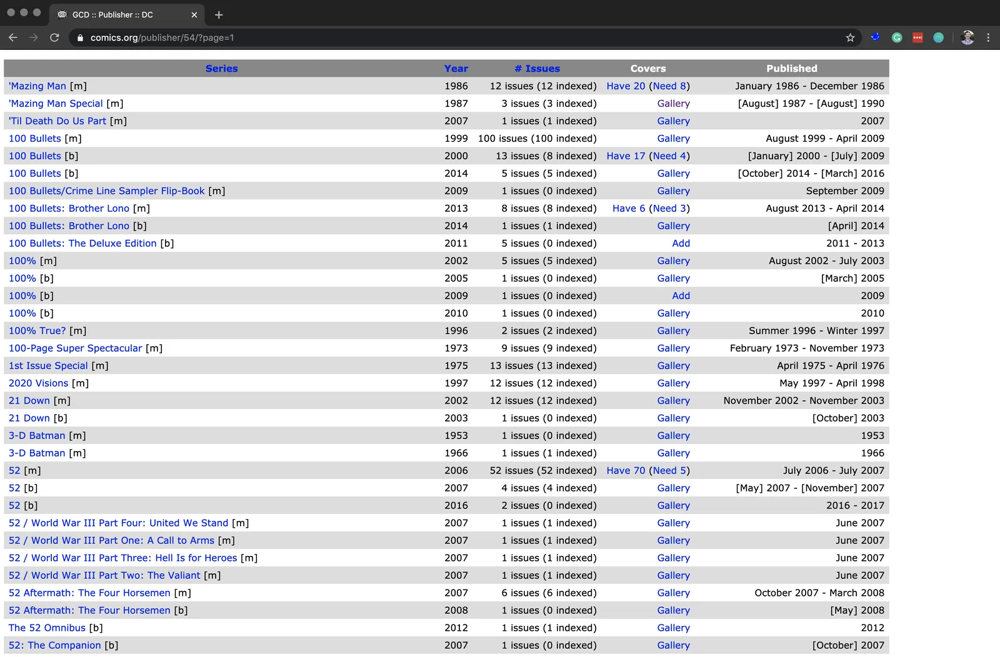
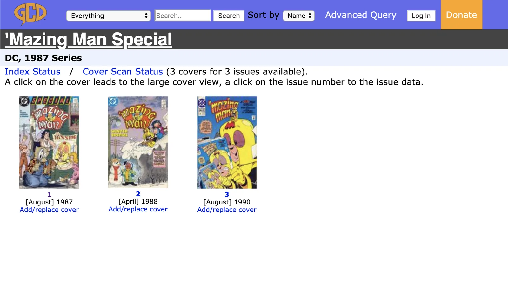
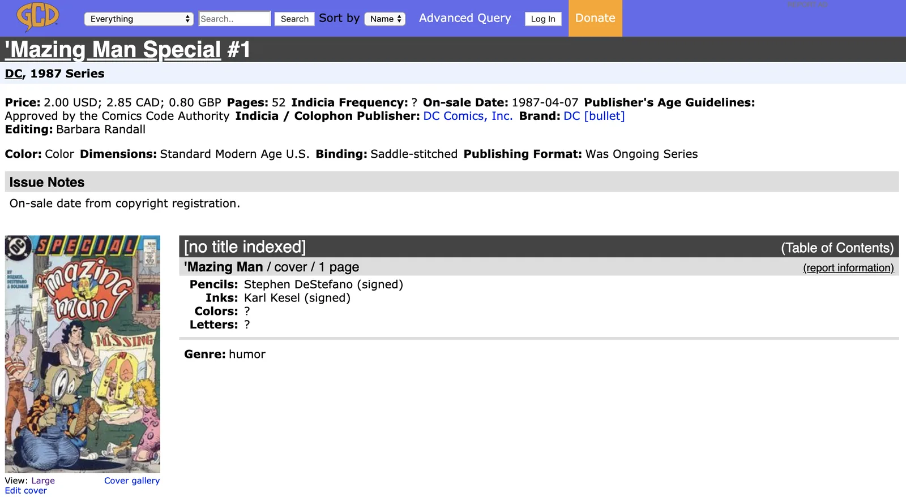
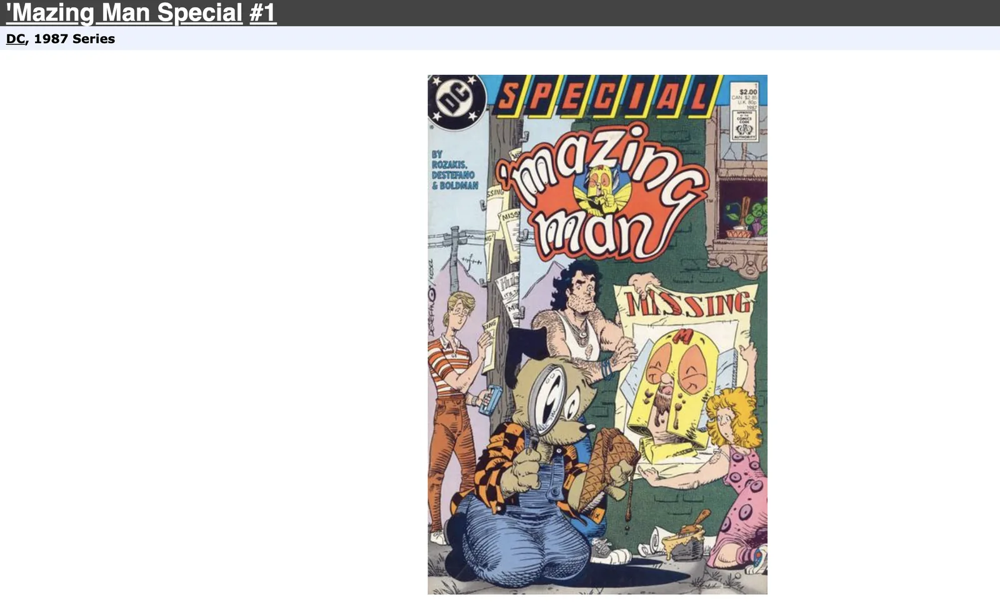

Here I present the lessons I learned while creating a web-scraper module for my [ComicsNet](https://seanmacrae.com/tag/comicsnet/) project. I don’t consider this module to be a _proper_ Python package at all yet; maybe ever. It is the mildewing tech debt of Data Science. Tech debt, like financial debt, has many forms and, depending on conditions, can be either responsible or ill-advised. For example, taking out a small business loan to grow inventory and scale distribution can be considered good debt. However, financing a shopping spree at Manolo Blahnik on a 30% APR line of credit is terrible debt (well, if you don’t pay it off that month).

A similar argument can be made for data science – and why I’m never going to obsess over making the web scraping component of ComicsNet robust. It’s kludgey at times, showing a great disregard for proper software development. But, my aim is not to support a web scraping module for people who want to scrape a custom dataset from [https://www.comics.org](https://www.comics.org). My goal is to curate an extensive and exciting dataset that I can publish and refer to as an artifact in my modeling efforts. As such, this is tech debt that may pay dividends down the road in terms of the most essential piece to any data science project: labeled data. So I will accept and pay interest on that tech debt, and if the payments prove too high, I’ll just have to pay it down. But it’s a cost I’m willing to incur for now.

So, I need labeled data, and I need a lot of it. My bias is to move quickly through the research and development cycle at least once. That way, I can identify any big unknown-unknowns and chart-out the general lay of the land. Over optimizing any part in the R&D cycle – especially the first time through – can come at the cost of how long it takes to form an understanding of the entire problem space; things like, the data, downstream dependencies, integration complexity, or customer requirements. My understanding can change, and I want to expose as much of the problem space as possible to maximize the likelihood that I’m working on the right, or next most valuable, thing. The best way to do that is simply by trying to create the thing I want, end-to-end.

The purpose of this article is to detail how a person interested in web-scraping for the single-minded purpose of hobbling together a semi-reproducible, set of data and labels may go about that.

## JSONL

JavaScript Object Notation (JSON) is a standard data exchange format. It replaced XML in the mid-aughts as the preferred standard for sending and receiving data. JSON (sans L) is array-formatted and requires the entire array is parsed to return selected entries from some JSON file. JSONL is new-line delimited, and there’s no need to load the whole dataset into memory to index it. You can easily append new records to JSONL, which is why I selected this data standard. I wanted to log the events of the web scraper at runtime, where there’s a high frequency of I/O. Using standard JSON, I would have to read the entire JSON dataset, add the new record, and then write it back to JSON.

There are other benefits to JSONL. For machine learning, JSONL can be treated as an iterable, and selecting a single row can be performed without the requirement of loading the complete dataset into memory. For batch training models on large data, it’s desirable to be able to select the index of the next batch from the file.

## The Append-only Log

This is a pro-tip that I had to learn the hard way. If the script you are running does a bunch of things repeatedly, don’t wait until you’ve collected a bunch of stuff in memory to write it to disk. Log each step to a file as you go. Whenever you invariably get snagged by some corner case that fails halfway through the job, you won’t lose all the information you’ve already collected. If you build your application in a way to reason about the log, then you can configure it to kick off the job again, picking back up where it failed before.

Here’s an example of a single record in the scraped dataset. Each row in the JSONL file contains an object like this.

```
{
    "series_name": "Action Comics",
    "title": "Action Comics #1",
    "on_sale_date": "1938-04-18",
    "indicia_frequency": "monthly",
    "issue_indicia_publisher": "Detective Comics, Inc.",
    "issue_brand": "",
    "issue_price": "0.10 USD",
    "issue_pages": "68",
    "format_color": "color",
    "format_dimensions": "standard Golden Age US; then standard Silver Age US; then standard Modern Age US",
    "format_paper_stock": "",
    "format_binding": "saddle-stitched (squarebound #334, 347, 360, 373, 437, 443, 449, 544, 600)",
    "format_publishing_format": "was ongoing series",
    "rating": "",
    "indexer_notes": "Indicia: | In Alter Ego #56 (February 2006), in an interview with Adler, he reports that he painted the colors on the engraving plates for this story. Info added by Craig Delich. | This strip was originally prepared for newspaper publication, cut up and repaged. Black shading used. | Superman wears blue boots. Story continues in Action Comics #2. | Writer credit and synopsis added by Craig Delich. | Lettering credit and synopsis added by Craig Delich. | Synopsis added by Craig Delich. | Lettering credit and synopsis added by Craig Delich. | Marco's uncle is named in issue #4 and his father in issue #5. | Letterer credit, writer credit, and synopsis added by Craig Delich. | Synopsis added by Craig Delich. | Letterer credit added by Craig Delich. | Per Craig Delich, art MIGHT be by Sheldon Moldoff. Synopsis added by Delich. | Inside back cover.",
    "synopsis": "A space vehicle from a destroyed world lands on Earth, and its occupant becomes Superman. In addition, a scientific explanation for this being's powers is given. | Superman delivers a witness to the governor to stop an execution, then stops a wife-beater. Later Superman, as Clark Kent, goes out with Lois, but she earns the wrath of Butch Matson and Superman must save her. Finally, Clark is assigned a story on the South American republic of San Monte. He heads to Washington DC to find out who is behind Senator Barrows pushing legislation which will embroil the United States in a war in Europe by grabbing lobbyist Alex Greer and scaring the truth out of him. | Chuck begins a vendetta aginst the crooked ranch owners who have, by fraud, acquired the range lands he inherited after his father's death. | Zatara and Tong investigate the murders of several railroad detectives and the theft of over $200,000 in loot. | Bret and Cottonball seek to rescue one Samuel Newton, whose daughter was carried off into the jungle by a pack of savage natives. | Sticky swipes some apples and is pursued by the police.  He gets a lucky break to make good his escape. | Marco, his father and his uncle are given an audience with the new Pope. They are sent on a mission to satisfy a request from the Khan of Tartary for priests and men of learning. | When the Boxing Commission runs a dirty fight trainer out of town, he swears his revenge...against Pep. | An international jewel thief arrives in America as a prisoner, but Scoop and Rusty are on hand to witness his escape with the help of his gang lying in wait. | Ken is framed for the murder of a man, and, with the help of Betty and Bobby, sets out to prove his innocence. | Interesting facts about celebrities Fred Astaire, Constance Bennett, Charles Boyer and the comedy team of Wheeler and Woolsey are provided in this illustrated filler.",
    "covers": {
        "Original": {
            "cover_pencils": "Joe Shuster (see notes)",
            "cover_inks": "Joe Shuster (see notes)",
            "cover_colors": "Jack Adler (see notes)",
            "cover_letters": "typeset",
            "cover_genre": "superhero",
            "cover_characters": "Superman [Clark Kent]",
            "cover_keywords": "automobiles",
            "save_to": "./covers/Action Comics: Action Comics #1 Original (1938-04-18).jpg",
            "image_url": "https://files1.comics.org//img/gcd/covers_by_id/0/w400/526.jpg?1510145167273009375"
        }
    }
}
```

And the value of the `save_to` key points to a path containing the comic book cover image:


## Beautiful Soup

The grappling hook of the `comcics_net.webscraper` utility belt is  
this method takes a URL and returns a BS4 object. It is the workhorse of the whole module.

```
def get_soup(url: str) -> BeautifulSoup:
    """
    Given a url returns a tree-based interface for parsing HTML.
    """
    html = simple_get(url)
    return BeautifulSoup(html, "html.parser")
```

If you’re web-scraping in Python, start with BeautifulSoup. It parses HTML (a tree-like data structure) into Python objects. Navigating, searching, and modifying parse trees is far more ergonomic than reasoning about strings.

### Understand the URL Subdirectory

A standard URL consists of a schema (http:// or https://), subdomain (google, stackoverflow, etc.), top-level domain (.com, .edu, .io) and subdirectory. The subdirectory defines the particular page or section of a webpage you’re on. Some website subdirectory structure design is highly interpretable. If so, it may be straight forward to navigate the site programmatically by generating URLs on the fly. After poking around the site a bit, I decided to use the publisher and page subdirectory keys as the URL entry-point. The publisher page is what the web-scraper would be configured to at the start of programmatically traversing a page, clicking into links, and pulling down data.

```
https://www.comics.org/publisher/54/?page=1
```

The above URL is for publisher 54 (Detective Comics, or DC), page 1. Each publisher page contains a table of their published Series with some metadata.



The “Covers” field on the Publisher’s page contains a link that can be followed to a Series page. When you click through, you’ll see that the URL subdirectory changes, reflecting the different subdirectory you are now in.

```
https://www.comics.org/series/3370/covers/
```



From the Series page, it was an exercise in mapping over each issue, collecting the links, and following each to their Issues page. Once again, clicking through an Issue link takes you to a new subdirectory.

```
https://www.comics.org/issue/42256/
```



I then scraped the cover metadata from the issue page and follow the issue page link to the cover image:

```
https://www.comics.org/issue/42256/cover/4/
```



And download the attached jpeg and log the issue metadata and image to the logger.

To perform the above navigation required parsing many different HTML tree structs. I found it easier to think about each page as a class object with defined attributes. I then wrote methods that take this class type. For example, an issue page would be referred to as an `issue_soup` object. Knowing the attributes of `issue_soup`, I could then do something particular with that object, like parse it for the title. I wrote many methods that take a `BS4` object and return some features of that class type. For example:

```
def get_issue_title(issue_soup: BeautifulSoup) -> str:
 """
 Return the title of the issue page.
 """
 return (
 issue_soup.find("title")
 .contents[0]
 .replace("\n", "")
 .strip()
 .split(" :: ")[-1]
 .replace("/", "|")
 )
```

This is a typical pattern I repurposed as I poked around and deduced what meta-data features I could extract, and how.

There’s some real nasty stuff in the webscraper methods that I look back on now and shudder—making heads or tails out of any of these methods now? No way! But once again, that’s OK, because this isn’t designed to be reusable software – it’s all a one-time effort to curate a dataset and do some deep learning.

## Save Yourself Some Time w/ a `main()`

If you thought `comics_net.webscraper` had some tech debt, you ain’t seen `comics _net.webscraper_main` yet. It takes all of the relatively well-named methods in the `webscraper` module and composes them into a teetering collection of nested if/else statements that each address some one-off, not well-documented detail of the statically-generated website. This was developed through a sheer process of elimination after much debugging and failed runs. Thomas Edison’s old quote about a million-ways that don’t work is true.

By URL. How are your URLs structured? I converged on a pattern around issue URLs early. I regretted not using a more generic interface for web scraping and parameterizing the `main()` to run on an artist or search results pages. Parameterize Your `main()`.

```
python3 comics_net/webscraper_main.py\
 --publisher_id 78\
 --publisher_page 84\
 --issue_count 2
```

## Use std out

So you see what’s happening. Just hitting execute and then waiting in the dark for your computer to return what you asked it to – especially if it takes more than minutes. Add a progress bar. Add an index count. Add some logging messages just saying what you did – like: “Loaded 378 records from s3://comics-net/avengers”. You’ll be thankful you did once you start cranking your web scraper to run all night.

## And don’t get blocked!

Add a `wait()` statement. I added `random.random(2, 5)`, so that on average, the request would wait somewhere before 2 and 5 seconds before proceeding to the next request.
